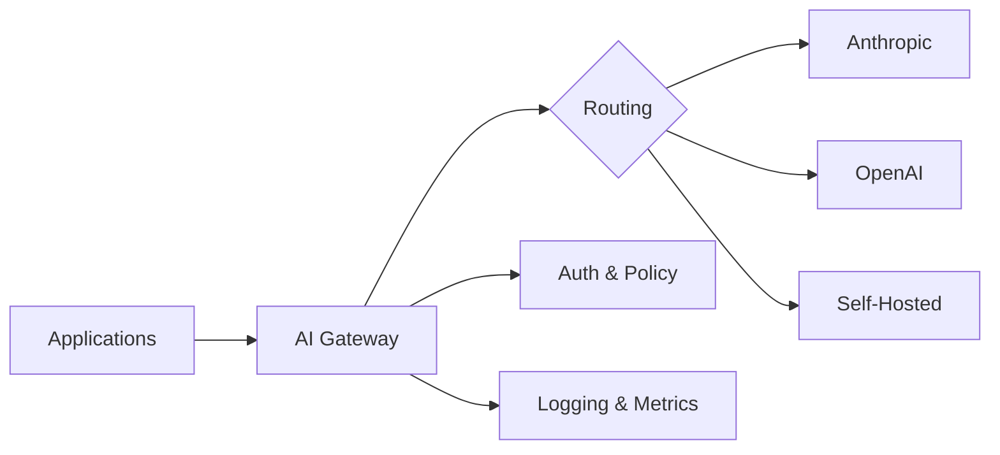

Most enterprises start their generative AI journey by giving a few teams API keys and letting them experiment. That works for a proof of concept, but it creates a mess at scale: fragmented billing, inconsistent security posture, no visibility into what models are being called or with what data. The fix is a **platform foundation** — a thin, opinionated layer that sits between your teams and the model providers.

This post covers the three pillars of that foundation: **governance**, a **model catalog**, and an **AI gateway**.

## Governance: Setting the Rules Before Writing the Code

A governance framework is not a bureaucratic speed bump — it is the operating agreement that lets teams move quickly without stepping on compliance landmines. At minimum you need an **Acceptable Use Policy (AUP)** that every team reads before they get access to the platform.

A practical AUP covers:

- **Approved use cases** — content generation, summarization, code assistance, and internal knowledge retrieval are common starting points
- **Data classification boundaries** — which data tiers (public, internal, confidential, restricted) are permitted for each model tier
- **Human oversight requirements** — any customer-facing output must be reviewed by a human before delivery; fully autonomous actions are limited to internal tooling
- **Prohibited uses** — no generation of legal advice, medical diagnoses, or content that impersonates real individuals
- **Incident reporting** — if a model produces harmful or unexpected output, teams must report it within 24 hours through the platform's incident channel
- **Review cadence** — the AUP is reviewed quarterly and updated as new model capabilities and regulatory guidance emerge

Governance also includes model selection criteria, cost guardrails, and a review board that meets monthly to approve new use cases. The AUP is the most important artifact because it is the one every developer actually reads.

## Model Catalog: Know What You Have

A model catalog is a registry of every model available on the platform — who provides it, what it costs, what data it can see, and whether it is active. Without one, teams make ad-hoc choices and you end up with six different models doing the same job at wildly different price points.

Here is an example catalog entry:

```yaml
model_id: claude-sonnet-4-5
provider: anthropic
endpoint: https://gateway.internal/v1/claude-sonnet-4-5
tier: general
context_window: 200000
cost_per_1k_input_tokens: 0.003
cost_per_1k_output_tokens: 0.015
approved_data_classifications:
  - public
  - internal
  - confidential
status: active
```

Each entry is stored as a YAML file in a Git repository. Teams submit pull requests to add or update models, and the platform team reviews them against the governance criteria. This gives you an auditable history of every model decision.

The catalog feeds into the AI gateway's routing logic: if a team's request references a model that is not in the catalog or not approved for their data classification, the gateway rejects it before any tokens are spent.

## AI Gateway: The Single Front Door

The AI gateway is the centerpiece of the platform. Every request from every team passes through it, which gives you one place to enforce authentication, apply rate limits, log prompts and completions, and route traffic to the right provider.



A typical gateway configuration uses LiteLLM to abstract provider differences and add fallback logic:

```yaml
model_list:
  - model_name: default-chat
    litellm_params:
      model: anthropic/claude-sonnet-4-5
      api_key: os.environ/ANTHROPIC_API_KEY
      max_tokens: 4096
      timeout: 30
  - model_name: default-chat
    litellm_params:
      model: openai/gpt-4o
      api_key: os.environ/OPENAI_API_KEY
      max_tokens: 4096
      timeout: 30

router_settings:
  routing_strategy: latency-based-routing
  num_retries: 2
  fallbacks:
    - default-chat: [default-chat]
```

With this configuration, the gateway tries the primary provider first and falls back to the secondary if it times out or returns an error. Teams never need to know which provider actually served their request.

### Choosing a Gateway Pattern

There are several ways to deploy a gateway. The right choice depends on your cloud environment, team size, and operational maturity.

| Pattern | Examples | Strengths | Trade-offs |
|---------|----------|-----------|------------|
| Cloud-native | AWS Bedrock, Azure AI Gateway, GCP Vertex | Managed infrastructure, native IAM integration, minimal ops burden | Provider lock-in, limited multi-cloud routing, fewer customization options |
| Third-party proxy | LiteLLM, Portkey, Helicone | Multi-provider routing, built-in observability, fast to deploy | External dependency, potential latency overhead, varying OSS license terms |
| Self-hosted | Custom NGINX/Envoy + sidecar logic | Full control over routing and data handling, no external dependencies | High engineering investment, you own the operational burden, slower to iterate |

Most teams start with a third-party proxy to get running quickly, then evaluate whether to migrate to a cloud-native solution once their traffic patterns stabilize.

## Putting It Together

The three pillars reinforce each other. Governance defines the rules, the model catalog encodes them as data, and the gateway enforces them at runtime. Without governance, the gateway has no policies to apply. Without the catalog, the gateway has no routing table. Without the gateway, governance is just a document nobody reads.

Start with the simplest version of each — a one-page AUP, a YAML file with three models, and a LiteLLM instance behind a load balancer. You can add sophistication later as your workload count grows. The important thing is that the foundation exists before teams start building production workloads on top of it.

In the next post, we cover the operational layer that sits on top of this foundation: observability, security, and developer experience.
