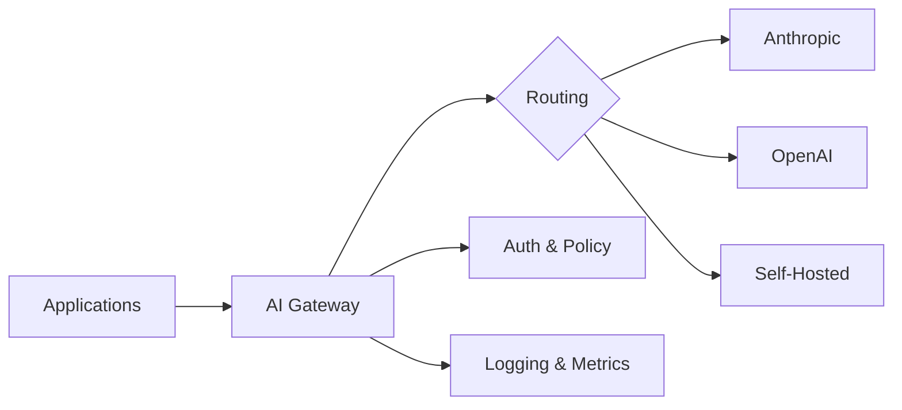
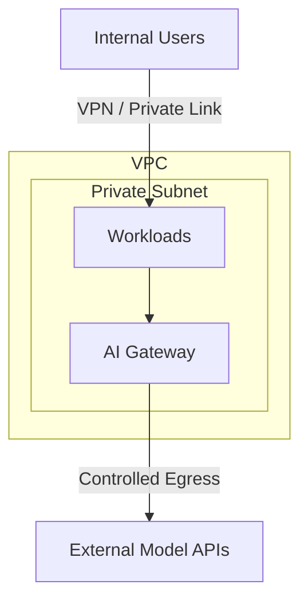

Most enterprises start their generative AI journey by giving a few teams API keys and letting them experiment. That works for a proof of concept, but it creates a mess at scale: fragmented billing, inconsistent security posture, no visibility into what models are being called or with what data. The fix is not three separate systems — it is two things: an **organizational agreement** (governance) and a **properly deployed AI gateway**. The gateway is the platform. Governance tells it what to enforce.

## Governance: The Operating Agreement

A governance framework is not a bureaucratic speed bump — it is the operating agreement that lets teams move quickly without stepping on compliance landmines. At minimum you need an **Acceptable Use Policy (AUP)** that every team reads before they get access to the platform.

A practical AUP covers:

- **Approved use cases** — content generation, summarization, code assistance, and internal knowledge retrieval are common starting points
- **Data classification boundaries** — which data tiers (public, internal, confidential, restricted) are permitted for each model tier
- **Human oversight requirements** — any customer-facing output must be reviewed by a human before delivery; fully autonomous actions are limited to internal tooling
- **Prohibited uses** — no generation of legal advice, medical diagnoses, or content that impersonates real individuals
- **Incident reporting** — if a model produces harmful or unexpected output, teams must report it within 24 hours through the platform's incident channel
- **Review cadence** — the AUP is reviewed quarterly and updated as new model capabilities and regulatory guidance emerge

Governance also includes model selection criteria, cost guardrails, and a review board that meets monthly to approve new use cases. The AUP is the most important artifact because it is the one every developer actually reads.

These rules feed directly into how you configure the gateway. Every bullet above becomes a policy the gateway enforces at request time.

## The AI Gateway: Your Platform's Center of Gravity

The gateway is not one of several equal pillars — it **is** the platform. A modern AI gateway (LiteLLM, Portkey, Helicone, or a cloud-native equivalent) gives you most of what you need in a single deployment: a model registry, multi-provider routing with fallback, per-team authentication and API keys, cost tracking, budget enforcement, usage dashboards, a prompt playground, rate limiting, and request logging. Teams that try to build these capabilities as separate systems end up with integration headaches and duplicated infrastructure.

Every request from every team passes through the gateway, which gives you one place to enforce authentication, apply rate limits, log prompts and completions, and route traffic to the right provider.



### Defining Models in the Gateway

The model catalog is not a separate system — it is the gateway's configuration. Each model is defined as a YAML entry that captures provider, pricing, data classification, and status. Teams submit pull requests to add or update models, and the platform team reviews them against the governance criteria. This gives you an auditable history of every model decision.

```yaml
model_id: claude-sonnet-4-5
provider: anthropic
endpoint: https://gateway.internal/v1/claude-sonnet-4-5
tier: general
context_window: 200000
cost_per_1k_input_tokens: 0.003
cost_per_1k_output_tokens: 0.015
approved_data_classifications:
  - public
  - internal
  - confidential
status: active
```

If a team's request references a model that is not in the catalog or not approved for their data classification, the gateway rejects it before any tokens are spent.

### Routing and Fallback

A typical gateway configuration uses LiteLLM to abstract provider differences and add fallback logic:

```yaml
model_list:
  - model_name: default-chat
    litellm_params:
      model: anthropic/claude-sonnet-4-5
      api_key: os.environ/ANTHROPIC_API_KEY
      max_tokens: 4096
      timeout: 30
  - model_name: default-chat
    litellm_params:
      model: openai/gpt-4o
      api_key: os.environ/OPENAI_API_KEY
      max_tokens: 4096
      timeout: 30

router_settings:
  routing_strategy: latency-based-routing
  num_retries: 2
  fallbacks:
    - default-chat: [default-chat]
```

With this configuration, the gateway tries the primary provider first and falls back to the secondary if it times out or returns an error. Teams never need to know which provider actually served their request.

### What You Get From This Single Deployment

Out of the box, a properly configured gateway gives you: per-team API key management and authentication, cost tracking and budget limits that cap teams automatically when they exceed their allocation, usage dashboards showing token consumption and error rates in real time, a playground for testing prompts against different models without writing code, rate limiting to prevent any single workload from monopolizing capacity, and structured request/response logging that feeds your observability stack. These are not features you build separately — they ship with the gateway.

### Choosing a Gateway Pattern

There are several ways to deploy a gateway. The right choice depends on your cloud environment, team size, and operational maturity.

| Pattern | Examples | Strengths | Trade-offs |
|---------|----------|-----------|------------|
| Cloud-native | AWS Bedrock, Azure AI Gateway, GCP Vertex | Managed infrastructure, native IAM integration, minimal ops burden | Provider lock-in, limited multi-cloud routing, fewer customization options |
| Third-party proxy | LiteLLM, Portkey, Helicone | Multi-provider routing, built-in observability, fast to deploy | External dependency, potential latency overhead, varying OSS license terms |
| Self-hosted | Custom NGINX/Envoy + sidecar logic | Full control over routing and data handling, no external dependencies | High engineering investment, you own the operational burden, slower to iterate |

Most teams start with a third-party proxy to get running quickly, then evaluate whether to migrate to a cloud-native solution once their traffic patterns stabilize.

## Network Architecture: Where the Gateway Lives

The gateway is your platform, but it needs to live somewhere secure. Generative AI introduces new attack surfaces — prompt injection, data exfiltration through model outputs, and accidental exposure of sensitive data in prompts — so the network architecture must limit blast radius.



Three design decisions matter most:

- The gateway and workloads live in a **private subnet** with no direct internet access. Egress to model provider APIs goes through a NAT gateway or AWS PrivateLink where available.
- All traffic between workloads and the gateway is **mTLS-encrypted**.
- Prompts containing data above a model's approved classification tier are **rejected at the gateway** before they leave the VPC.

### Data Classification Mapping

This mapping is a governance decision that the gateway enforces at request time. Every model in the catalog is approved for specific data tiers.

| Data Classification | Allowed Model Tiers | Example Models | Controls |
|--------------------|--------------------|----------------|----------|
| Public | Any | All catalog models | Standard logging |
| Internal | General, Premium | Claude Sonnet, GPT-4o | Prompt logging enabled, PII scanning |
| Confidential | Premium only | Claude Sonnet (private endpoint) | Private endpoint, no prompt logging, DLP scanning |
| Restricted | Self-hosted only | Fine-tuned Llama on internal GPU cluster | Air-gapped, full audit trail, manual review |

This table is one of the most referenced artifacts on the platform. Pin it to the team wiki and review it every quarter.

## Getting Started

The gateway is your platform. Governance tells it what to enforce. The network tells it where to run. Start with a one-page AUP, a LiteLLM instance in a private subnet, and three models. You can add sophistication later as your workload count grows. The important thing is that the foundation exists before teams start building production workloads on top of it.

You now have a foundation. The [next post](/blog/genai-platform-operations-observability-security-devex) covers the ongoing operational work the gateway cannot do for you: wiring metrics into your ops stack, ongoing security operations, and developer enablement.
