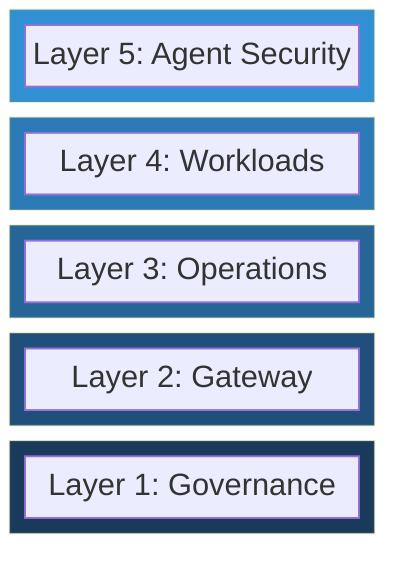

Every enterprise we talk to has the same story. A few teams ran successful GenAI experiments. Leadership got excited. Now dozens of teams want access, and nobody agrees on how to provide it. The result is predictable: shadow AI sprawling across departments, fragmented tooling, ungoverned costs, and no shared vocabulary for how the organization should operate generative AI in production.

The GenAI Adoption Framework (GAF) is our answer to that problem. It is a structured, vendor-agnostic blueprint for planning, governing, and scaling generative AI adoption. It does not tell you which products to buy. It tells you what capabilities you need, in what order, and how to know when you are ready for the next step.

## The Core Idea: Five Stacking Layers

GAF organizes everything an enterprise needs into five capability layers. Each layer builds on the one below it. This is the single most important design decision in the framework — higher layers assume the capabilities of lower layers are in place. Skip a layer and you build on sand.

**Layer 1: Governance** establishes the policy foundation — data classification, acceptable use policies, regulatory mapping, and oversight structures. Every subsequent layer depends on these decisions. Without governance, the gateway has no rules to enforce.

**Layer 2: Gateway** provides a centralized control plane for all model traffic. Authentication, routing, rate limiting, cost tracking, and policy enforcement happen here. The gateway is not one of several systems — it is the platform.

**Layer 3: Operations** delivers the observability, security operations, cost management, and developer enablement that a running gateway cannot do for you. Metrics need to flow into alerts. Security events need triage workflows. Developers need documentation and a playground.

**Layer 4: Workloads** covers the discipline of building individual AI features — scoping use cases, selecting models, engineering prompts, evaluating outputs, and testing for adversarial inputs. This is where teams actually build.

**Layer 5: Agent Security** addresses the unique security surface that appears when workloads become autonomous agents — identity, fine-grained authorization, tool-use control, and audit trails that link every action back to a human owner.

## Three Maturity Stages

Not every organization needs all five layers on day one. GAF defines three maturity stages that describe the progression from initial adoption to optimized operations.

| Stage | Name | What It Means |
|-------|------|---------------|
| 1 | **Foundation** | Minimum viable platform. Core governance policies are defined, a gateway exists, and basic observability is in place to support initial production workloads. |
| 2 | **Operational** | Production-ready posture. Policy enforcement is automated, operations are instrumented end-to-end, workloads follow a standardized lifecycle, and security controls cover both model and agent interactions. |
| 3 | **Optimized** | Continuous improvement. Governance adapts dynamically to new regulations and threat models, cost and performance are actively tuned, and feedback loops connect workload outcomes to platform capabilities. |

A critical nuance: maturity is assessed **per layer**, not globally. Your governance might be at Stage 2 while your agent security is still at Stage 1. That is normal. The maturity model helps you identify where to invest next rather than pretending every layer advances in lockstep.

## Ten Principles

The framework is grounded in ten universal principles that apply across all layers and stages. These are not aspirational values — they are design constraints that shape every decision.

| Principle | What It Means |
|-----------|---------------|
| **Human Accountability** | Every AI action traces back to a named human owner. |
| **Default Deny** | Access is denied unless explicitly granted through a governed process. |
| **Defense in Depth** | Security controls exist at every layer; no single point of failure. |
| **Least Privilege** | Every identity gets the minimum access required for its current task. |
| **Observability by Design** | Every layer emits structured telemetry from day one. |
| **Version Everything** | Policies, prompts, configs, and guardrails are version-controlled like code. |
| **Automate Enforcement, Humanize Judgment** | Machines enforce policy at scale; humans define, tune, and override it. |
| **Tight Feedback Loops** | Monitoring informs policy; policy changes are immediately reflected in monitoring. |
| **Separation of Concerns** | Each layer has a single responsibility and does not absorb adjacent ones. |
| **Progressive Disclosure of Complexity** | Start simple, add sophistication as maturity demands it. |

The most operationally impactful of these is **Progressive Disclosure of Complexity**. It means you do not need to solve every problem before shipping your first workload. Stand up governance and a gateway. Get one workload into production. Then layer in operations maturity, then workload standards, then agent security — each step justified by real demand rather than hypothetical requirements.

## Where to Start

The framework is designed to serve multiple audiences. Here is where to begin based on your role:

**If you are a CTO or VP of Engineering**, start with the maturity model. It maps organizational readiness to concrete capability milestones and gives you the vocabulary for executive alignment and investment planning.

**If you are a platform engineer**, start at Layer 1 and work upward. Governance and Gateway are your foundation — everything else depends on them. The reference architectures provide structural patterns for single-cloud, multi-cloud, hybrid, and air-gapped deployments.

**If you are a security architect**, start with the cross-cutting concerns (risk management, compliance, responsible AI) and Layer 5 (Agent Security), then review each layer's security controls.

**If you are a workload developer**, start at Layer 4 and work downward as questions arise about what the platform provides or what policies constrain your use case.

## Why Vendor-Agnostic?

GAF intentionally avoids naming specific products, cloud providers, or proprietary platforms. This is not an academic exercise — it is a practical decision. The GenAI ecosystem is moving so fast that any product recommendation becomes outdated within months. By describing capabilities and patterns rather than specific tools, the framework remains durable across technology shifts. When you evaluate a gateway product or an observability stack, use the framework's capability descriptions as your evaluation criteria.

## The Full Framework

The GenAI Adoption Framework is open source and available on [GitHub](https://github.com/Odovey-Consulting/genai-adoption-framework). It includes detailed documentation for each layer, maturity stage assessments, cross-cutting concern guides, reference architectures, and deployment checklists.

Sequence matters. Governance before Gateway. Gateway before Operations. Operations before Workloads. Workloads before Agent Security. Each layer assumes the one below it is in place. Start at the bottom, build up, and do not skip layers.
