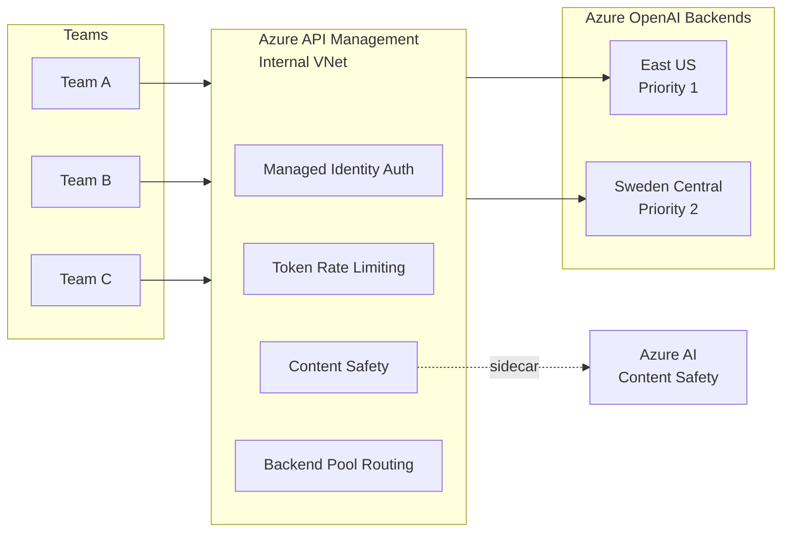
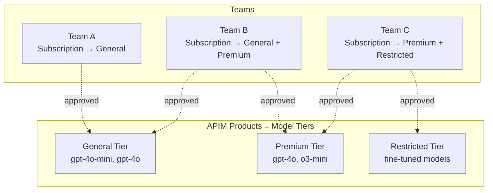
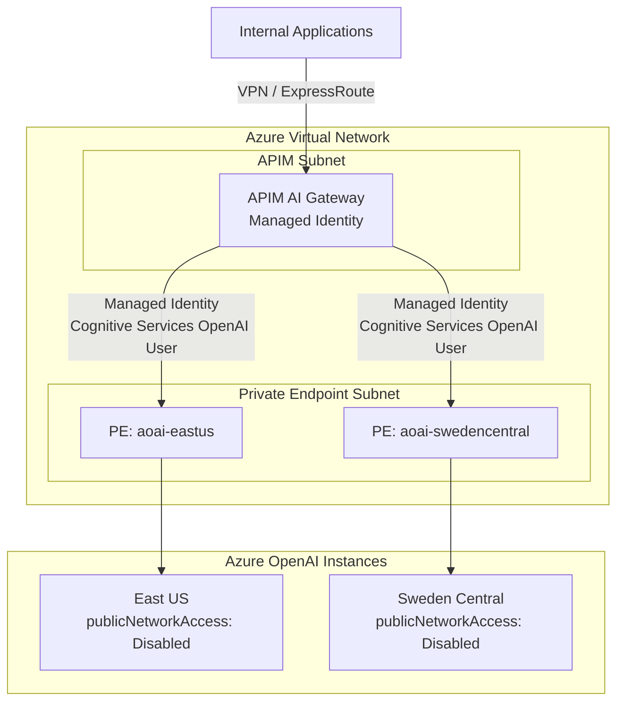

> *We implement the [GenAI Adoption Framework](https://github.com/Odovey-Consulting/genai-adoption-framework) using Azure as the reference platform. The patterns — centralized gateway, token-based rate limiting, data classification enforcement — are provider-agnostic. See the framework for the vendor-neutral specification.*

Most enterprises start their generative AI journey by giving a few teams API keys and letting them experiment. That works for a proof of concept, but it creates a mess at scale: fragmented billing, inconsistent security posture, no visibility into what models are being called or with what data. The fix is not three separate systems — it is two things: an **organizational agreement** (governance) and a **properly deployed AI gateway**. The gateway is the platform. Governance tells it what to enforce.

This post implements **GAF Layers 1 and 2 — Governance and Gateway** — the minimum viable platform for **Stage 1: Foundation** (4–8 weeks). We demonstrate three GAF principles: **Default Deny**, **Defense in Depth**, and **Version Everything**.

## GAF Layer 1: Governance — The Operating Agreement

A governance framework is not a bureaucratic speed bump — it is the operating agreement that lets teams move quickly without stepping on compliance landmines. At minimum you need an **Acceptable Use Policy (AUP)** that every team reads before they get access to the platform.

### AUP Template

The AUP is your most important governance artifact — the one every developer actually reads. Fork this template and fill in the blanks for your organization:

```markdown
# GenAI Acceptable Use Policy v[VERSION]

**Effective:** [DATE] | **Owner:** [NAME, TITLE] | **Review cadence:** Quarterly

## Approved Use Cases
- [ ] Content generation (marketing copy, documentation drafts)
- [ ] Summarization (support tickets, meeting notes, reports)
- [ ] Code assistance (code review, refactoring suggestions, test generation)
- [ ] Internal knowledge retrieval (RAG over internal documentation)
- [ ] [ADD YOUR USE CASES]

## Prohibited Uses
- Generation of legal advice, medical diagnoses, or financial recommendations
- Content that impersonates real individuals
- Fully autonomous customer-facing actions without human review
- Processing of Restricted-tier data through external model providers
- [ADD YOUR PROHIBITIONS]

## Data Handling
- All prompts must comply with the data classification mapping below
- No customer PII in prompts to General-tier models
- Confidential data requires Premium-tier models with private endpoints
- Restricted data must not leave the organization boundary

## Human Oversight
- All customer-facing outputs require human review before delivery
- Autonomous agent actions limited to internal tooling at Stage 1
- Go/no-go owner named for every production workload

## Incident Reporting
- Model producing harmful or unexpected output: report within 24 hours
- Channel: [SLACK CHANNEL / EMAIL / INCIDENT SYSTEM]
- Escalation: [SECURITY TEAM CONTACT]

## Acknowledgment
I have read and agree to this policy.
Name: __________ Team: __________ Date: __________
```

This connects to the GAF principle **Version Everything** — the AUP lives in Git, changes go through pull request review, and every version is traceable. It is not a wiki page someone edits in place.

**GAF Stage 1 exit criteria addressed:** AUP drafted, reviewed by legal, circulated to all teams.

### Data Classification Mapping

This mapping is a governance decision that the gateway enforces at request time. In Azure, each tier maps to a specific Azure OpenAI deployment configuration:

| Data Classification | Azure OpenAI Deployment Type | APIM Product Tier | Controls |
|--------------------|-----------------------------|-------------------|----------|
| Public | Standard (shared infrastructure) | General | Standard logging, content safety |
| Internal | Standard with diagnostic logging | General / Premium | Prompt logging enabled, content safety, PII scanning |
| Confidential | Private endpoint (dedicated) | Premium | Private endpoint only, no prompt logging to shared workspace, DLP scanning |
| Restricted | Not permitted on external models | — | Must use self-hosted models on internal compute |

**GAF Stage 1 exit criteria addressed:** Data classification scheme with 3+ tiers applied.

## GAF Layer 2: Gateway — Azure API Management as AI Gateway

Azure API Management (APIM) is the AI gateway. Every request from every team passes through APIM, which gives you one place to enforce authentication, apply rate limits, run content safety checks, log prompts and completions, and route traffic to the right Azure OpenAI backend.



### Bicep: APIM + Azure OpenAI Backends

Deploy the gateway and backends as infrastructure-as-code. Note: circuit breaker and priority routing require **APIM Standard v2 or Premium SKU**.

```bicep
// apim-ai-gateway.bicep — Core APIM + Azure OpenAI infrastructure

@description('Primary Azure OpenAI instance')
resource aoaiPrimary 'Microsoft.CognitiveServices/accounts@2024-10-01' = {
  name: 'aoai-eastus'
  location: 'eastus'
  kind: 'OpenAI'
  sku: { name: 'S0' }
  properties: {
    publicNetworkAccess: 'Disabled'
    networkAcls: { defaultAction: 'Deny' }
  }
}

@description('Secondary Azure OpenAI instance for failover')
resource aoaiSecondary 'Microsoft.CognitiveServices/accounts@2024-10-01' = {
  name: 'aoai-swedencentral'
  location: 'swedencentral'
  kind: 'OpenAI'
  sku: { name: 'S0' }
  properties: {
    publicNetworkAccess: 'Disabled'
    networkAcls: { defaultAction: 'Deny' }
  }
}

@description('APIM instance — Standard v2 required for circuit breaker + priority routing')
resource apim 'Microsoft.ApiManagement/service@2024-06-01-preview' = {
  name: 'apim-ai-gateway'
  location: 'eastus'
  sku: { name: 'StandardV2' capacity: 1 }
  identity: { type: 'SystemAssigned' }
  properties: {
    virtualNetworkType: 'Internal'
    virtualNetworkConfiguration: {
      subnetResourceId: apimSubnet.id
    }
  }
}

@description('Backend pool with priority-based routing and circuit breaker')
resource backendPool 'Microsoft.ApiManagement/service/backends@2024-06-01-preview' = {
  parent: apim
  name: 'aoai-backend-pool'
  properties: {
    type: 'Pool'
    pool: {
      services: [
        {
          id: '/backends/aoai-eastus'
          priority: 1
          weight: 1
        }
        {
          id: '/backends/aoai-swedencentral'
          priority: 2
          weight: 1
        }
      ]
    }
  }
}

@description('Private endpoint for primary Azure OpenAI')
resource privateEndpoint 'Microsoft.Network/privateEndpoints@2024-05-01' = {
  name: 'pe-aoai-eastus'
  location: 'eastus'
  properties: {
    subnet: { id: privateEndpointSubnet.id }
    privateLinkServiceConnections: [
      {
        name: 'aoai-eastus-connection'
        properties: {
          privateLinkServiceId: aoaiPrimary.id
          groupIds: [ 'account' ]
        }
      }
    ]
  }
}

@description('Grant APIM managed identity access to Azure OpenAI')
resource roleAssignment 'Microsoft.Authorization/roleAssignments@2022-04-01' = {
  name: guid(apim.id, aoaiPrimary.id, cognitiveServicesOpenAIUser)
  scope: aoaiPrimary
  properties: {
    roleDefinitionId: subscriptionResourceId(
      'Microsoft.Authorization/roleDefinitions',
      '5e0bd9bd-7b93-4f28-af87-19fc36ad61bd' // Cognitive Services OpenAI User
    )
    principalId: apim.identity.principalId
    principalType: 'ServicePrincipal'
  }
}
```

### APIM Policy: The Full Inbound/Outbound Pipeline

This is where governance meets enforcement. Every bullet in the AUP becomes a policy the gateway enforces at request time.

```xml
<policies>
  <inbound>
    <base />

    <!-- GAF Principle: Default Deny — no request passes without valid subscription -->
    <check-header name="Ocp-Apim-Subscription-Key" failed-check-httpcode="401"
                  failed-check-error-message="Subscription key required" />

    <!-- GAF Principle: Defense in Depth — managed identity auth, no API keys to backends -->
    <authentication-managed-identity resource="https://cognitiveservices.azure.com" />

    <!-- Token rate limiting per subscription — enforces per-team TPM budgets -->
    <llm-token-limit tokens-per-minute="10000"
                     counter-key="@(context.Subscription.Id)"
                     estimate-prompt-tokens="true"
                     remaining-tokens-header-name="x-ratelimit-remaining-tokens" />

    <!-- Content safety — four categories + Prompt Shields -->
    <llm-content-safety>
      <text-content>
        <category name="Hate" threshold="Medium" />
        <category name="Violence" threshold="Medium" />
        <category name="SelfHarm" threshold="Medium" />
        <category name="Sexual" threshold="Medium" />
      </text-content>
      <prompt-shields />
    </llm-content-safety>

    <!-- Route to backend pool — priority-based with circuit breaker -->
    <set-backend-service backend-id="aoai-backend-pool" />
  </inbound>

  <outbound>
    <base />

    <!-- Emit token metrics with team/API/subscription dimensions -->
    <llm-emit-token-metric>
      <dimension name="Team" value="@(context.Subscription.Name)" />
      <dimension name="API" value="@(context.Api.Name)" />
      <dimension name="Subscription" value="@(context.Subscription.Id)" />
      <dimension name="Model" value="@(context.Request.Headers
        .GetValueOrDefault("x-model-deployment", "unknown"))" />
    </llm-emit-token-metric>
  </outbound>

  <on-error>
    <base />
  </on-error>
</policies>
```

This policy implements three GAF principles simultaneously:
- **Default Deny** — APIM rejects any request without a valid subscription key. Models not published to a team's APIM Product are unreachable.
- **Defense in Depth** — managed identity authentication (no API keys stored or transmitted), private endpoints (no public network access), content safety checks (input filtering), and rate limiting — multiple controls at multiple layers.
- **Version Everything** — APIM policies are defined in XML, stored in Git, deployed via Bicep. Every policy change is a versioned, reviewable artifact.

## Model Catalog as APIM Products and Subscriptions

The GAF model catalog maps directly to APIM's Product and Subscription model. APIM Products represent model tiers; Subscriptions represent team access grants.



Each APIM Product contains specific Azure OpenAI API endpoints. Teams request subscriptions (API keys) scoped to approved products. The subscription approval workflow uses APIM's built-in mechanism — a team submits a request through the developer portal, the platform team reviews it against governance criteria, and the subscription is either approved or rejected with rationale.

**GAF Stage 1 exit criteria addressed:**
- Model catalog with at least one approved model ✓
- Authentication enforced, API keys per team ✓
- Gateway handling all sanctioned model traffic ✓

## Network Architecture

The gateway and backends live in a private network. No Azure OpenAI endpoint is reachable from the public internet.



Key design decisions:
- APIM runs in **Internal VNet mode** — reachable only from the corporate network
- Azure OpenAI instances have **`publicNetworkAccess: Disabled`** — reachable only via private endpoints
- Authentication uses **managed identity** with the `Cognitive Services OpenAI User` role — no API keys to rotate, leak, or manage
- Traffic between APIM and Azure OpenAI traverses the **Azure backbone** via private endpoints — never the public internet

## Gateway Pattern Comparison

The GAF describes gateway capabilities in terms of what they accomplish, not which product provides them. Any product that delivers these capabilities satisfies the framework.

| Capability | Azure APIM (AI Gateway) | LiteLLM | Portkey | AWS Bedrock Gateway |
|-----------|------------------------|---------|---------|-------------------|
| Token rate limiting | `llm-token-limit` policy (GA) | Per-key TPM limits | Rate limiting rules | Token-based throttling |
| Content safety | `llm-content-safety` policy (GA) | External integration | Guardrails | Bedrock Guardrails |
| Multi-region failover | Backend pools with priority routing | Router fallback config | Gateway routing | Cross-region inference |
| Cost attribution | `llm-emit-token-metric` dimensions | Usage tracking | Analytics | CloudWatch metrics |
| Managed identity auth | Native (Entra ID) | N/A (API keys) | N/A (API keys) | Native (IAM roles) |
| Private network | Internal VNet mode + private endpoints | Self-hosted in VPC | SaaS (no VNet option) | VPC endpoints |
| IaC deployment | Bicep / ARM / Terraform | Docker / Helm | SaaS config | CloudFormation |

## Stage 1 Exit Criteria Checklist

Before moving to [operations](/blog/genai-platform-operations-observability-security-devex), verify you have met the GAF Stage 1: Foundation exit criteria:

- [ ] AUP drafted, reviewed by legal, circulated to all teams
- [ ] Data classification scheme documented with 3+ tiers
- [ ] Model catalog contains at least one approved model (APIM Product with published API)
- [ ] Cost ceiling set with enforcement mechanism (APIM token rate limits)
- [ ] Gateway deployed and handling all sanctioned traffic (APIM in Internal VNet)
- [ ] Authentication enforced on every request (APIM subscription keys)
- [ ] Request logging operational (Azure OpenAI diagnostic settings)
- [ ] At least one alert configured with a defined recipient

You now have a foundation. The [next post](/blog/genai-platform-operations-observability-security-devex) implements GAF Layer 3 — Operations — the ongoing work the gateway cannot do for you: wiring Azure Monitor metrics into alerts, Sentinel for security operations, and developer enablement.
