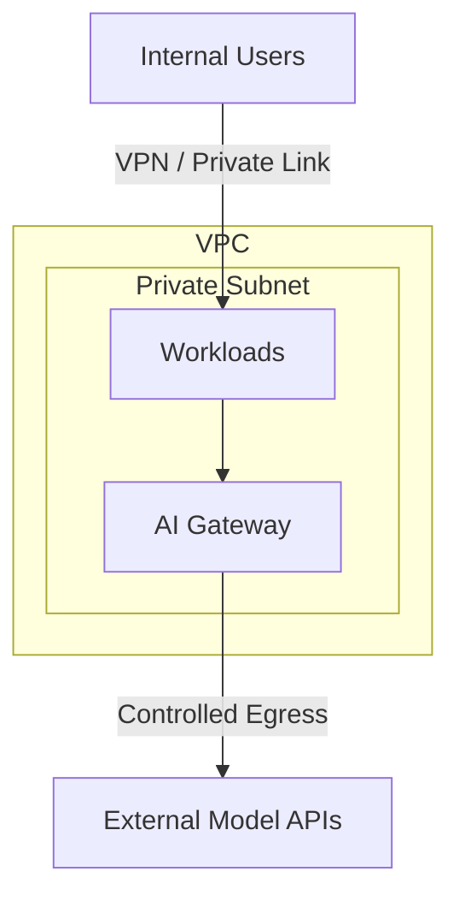

The [previous post](/blog/building-your-genai-platform-foundation) covered the foundation: governance, model catalog, and an AI gateway. That gets you from zero to one. This post covers what it takes to keep the platform running well — and to make sure developers actually want to use it.

Three operational concerns dominate: **observability**, **security**, and **developer experience**.

## Observability: Measure What Matters

Traditional APM tools were not built for LLM workloads. A single request can take 30 seconds, consume 100k tokens, and cost two dollars. You need metrics that capture the economics and performance characteristics unique to generative AI.

### Key Metrics

| Metric | Description | Why It Matters |
|--------|-------------|----------------|
| Token throughput | Input + output tokens per minute, per team | Capacity planning and cost forecasting |
| Cost per request | Dollar cost calculated from token counts and model pricing | Budget enforcement and chargeback |
| Time to first token (TTFT) | Latency from request sent to first token received | User-perceived responsiveness for streaming UIs |
| Error rate | Percentage of requests returning 4xx/5xx | Provider health and misconfiguration detection |
| Guardrail trigger rate | Percentage of requests blocked by content filters or policy rules | Governance effectiveness and false-positive tuning |

These five metrics give you a baseline. As the platform matures, add per-workload breakdowns, prompt length distributions, and cache hit rates if you implement semantic caching.

### Alerting

Metrics are useless without alerts. Here is a sample Prometheus alerting rule that fires when a team's daily spend exceeds their budget:

```yaml
groups:
  - name: genai-cost-alerts
    rules:
      - alert: TeamDailyCostOverrun
        expr: |
          sum by (team) (
            increase(genai_request_cost_dollars_total[24h])
          ) > on (team) group_left()
          genai_team_daily_budget_dollars
        for: 10m
        labels:
          severity: warning
        annotations:
          summary: "Team {{ $labels.team }} exceeded daily GenAI budget"
          description: >
            Spend is {{ $value | humanize }}$ against a budget of
            {{ with query "genai_team_daily_budget_dollars{team='{{ $labels.team }}'}" }}
            {{ . | first | value | humanize }}${{ end }}.
```

Wire this into your existing PagerDuty or Slack integration. Cost alerts should go to team leads, not on-call engineers — overspending is a planning problem, not an incident.

## Security: Defense in Depth

Generative AI introduces new attack surfaces: prompt injection, data exfiltration through model outputs, and accidental exposure of sensitive data in prompts. The network architecture should limit blast radius.



Key design decisions:

- The gateway and workloads live in a **private subnet** with no direct internet access. Egress to model provider APIs goes through a NAT gateway or AWS PrivateLink where available.
- All traffic between workloads and the gateway is mTLS-encrypted.
- Prompts containing data above a model's approved classification tier are rejected at the gateway before they leave the VPC.

### Data Classification Mapping

Every model in the catalog is approved for specific data tiers. The gateway enforces this mapping at request time.

| Data Classification | Allowed Model Tiers | Example Models | Controls |
|--------------------|--------------------|----------------|----------|
| Public | Any | All catalog models | Standard logging |
| Internal | General, Premium | Claude Sonnet, GPT-4o | Prompt logging enabled, PII scanning |
| Confidential | Premium only | Claude Sonnet (private endpoint) | Private endpoint, no prompt logging, DLP scanning |
| Restricted | Self-hosted only | Fine-tuned Llama on internal GPU cluster | Air-gapped, full audit trail, manual review |

This table is one of the most referenced artifacts on the platform. Print it, pin it to the team wiki, and review it every quarter.

## Developer Experience: Make the Right Thing the Easy Thing

A platform that developers avoid is a failed platform. The goal is to make calling a model through the gateway easier than calling the provider directly. That means good SDKs, clear documentation, and a "hello world" that works in under five minutes.

Here is what a developer's first interaction with the platform looks like — a streaming API call through the gateway using Python:

```python
import httpx

GATEWAY_URL = "https://gateway.internal/v1/chat/completions"
API_KEY = "team-abc-key-xxxxx"  # issued by the platform team

with httpx.stream(
    "POST",
    GATEWAY_URL,
    headers={
        "Authorization": f"Bearer {API_KEY}",
        "Content-Type": "application/json",
    },
    json={
        "model": "default-chat",
        "messages": [{"role": "user", "content": "Summarize this quarter's earnings report."}],
        "stream": True,
    },
    timeout=60.0,
) as response:
    for line in response.iter_lines():
        if line.startswith("data: ") and line != "data: [DONE]":
            print(line[6:], end="", flush=True)
```

This is deliberately simple. The developer does not need to know which provider backs `default-chat`, how fallback works, or where the logs go. The gateway handles all of that.

Beyond the first call, good developer experience means:

- **Self-service API key provisioning** through an internal portal — no Jira tickets
- **Usage dashboards** that show each team their token consumption, cost, and error rates in real time
- **Playground environment** where developers can test prompts against different models without writing code
- **Runbooks** for common issues: rate limit exceeded, model timeout, classification mismatch

## The Operational Flywheel

Observability feeds security (anomaly detection catches prompt injection patterns). Security feeds developer experience (clear data classification rules mean fewer rejected requests). Developer experience feeds observability (happy developers instrument their workloads, giving you better data).

Invest in all three from day one. Retrofitting observability or security after teams have already built production workloads is an order of magnitude harder than building it into the platform from the start.

In the next post, we shift from platform to workloads: how to scope, build, test, and ship a generative AI feature from idea to production.
