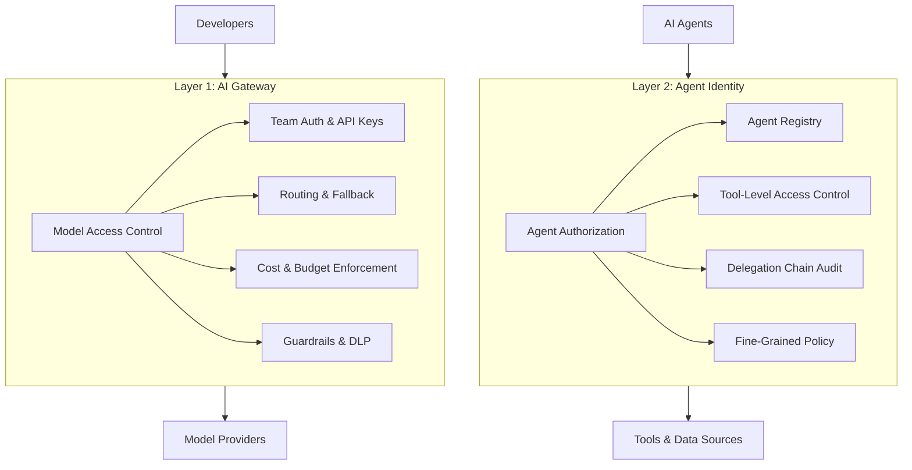
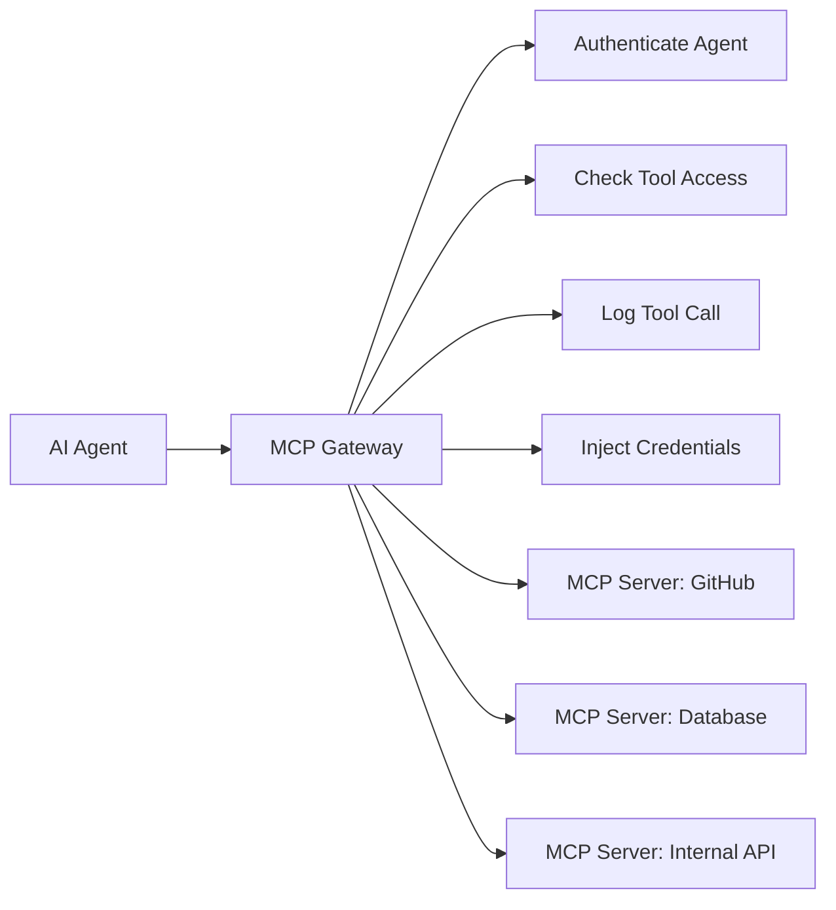

The first three posts in this series covered a complete platform stack: a [gateway foundation](/blog/building-your-genai-platform-foundation) that controls model access, [operations](/blog/genai-platform-operations-observability-security-devex) that keep the platform visible and secure, and a [workload development lifecycle](/blog/genai-workload-development-from-scoping-to-production) that takes features from scoping to production. That stack controls which models teams can call and how. But it assumes a human is driving every request.

When workloads become autonomous agents — calling APIs, querying databases, executing multi-step workflows on behalf of users — a new layer of control is required. The gateway controls model access for developers. Agent identity controls what agents can do with the tools they access.



This post covers Layer 2: why agents need identity, how the Model Context Protocol (MCP) defines the agent-tool interface, where MCP gateways fit as the enforcement point, and what the current landscape of agent identity platforms looks like.

## Why Agents Need Identity

Agents are not just API calls with a loop. They hold credentials, make decisions across multiple systems, and act with a degree of autonomy that a simple LLM request does not. Without identity controls, four problems emerge quickly:

- **Standing access** — agents accumulate long-lived credentials to production systems with no expiration or rotation
- **No audit trail** — when an agent modifies a database record or calls an external API, there is no link back to the human who authorized the action
- **No revocation** — if an agent is compromised, there is no mechanism to revoke its access across all the tools it touches
- **Shadow agents** — teams deploy agents outside the platform with no visibility into what they are doing or what data they can reach

The parallel to human identity is direct. Humans get SSO, role-based access control, access reviews, and conditional access policies. Agents need the same: registration in a central directory, scoped credentials with expiration, access policies that define which tools they can call, and lifecycle governance that includes periodic review.

The key principle: **every agent must have a human owner who is accountable for its actions.** An agent's permissions should never exceed its owner's, and every action the agent takes should be traceable back to that owner through a delegation chain.

## MCP: The Agent-Tool Interface

The Model Context Protocol (MCP) is the emerging standard for how agents communicate with tools. It defines how an agent discovers available tools, requests access, and executes tool calls. Think of it as the HTTP of the agent world — a shared transport that lets any agent talk to any tool server.

The MCP authorization specification (2025-11-25) uses OAuth 2.1 at the transport layer. Three mechanisms matter for enterprise security:

- **CIMD (Client ID Metadata Documents)** — stateless, web-native client registration where the client's URL is its identity. No pre-registration step required, which makes it practical for environments with many agents.
- **Resource indicators (RFC 8707)** — tokens are scoped to specific MCP servers, preventing token confusion attacks where a token issued for one server is replayed against another.
- **Enterprise-managed authorization (XAA/ID-JAG)** — admin-controlled agent authorization via your corporate IdP. This is the critical mechanism for enterprises: it lets your identity team manage agent permissions through the same IdP they already use for humans, without requiring per-action user consent popups.

The honest caveat: authorization is optional in the MCP spec. Many implementations skip it entirely, relying on network-level controls or no authentication at all. This is exactly why you need enforcement at the gateway layer — you cannot assume every MCP server in your environment implements auth correctly.

A brief note on A2A (Agent-to-Agent protocol from Google): it provides interoperability hooks for agents to communicate with each other, but security is opt-in, not enforced. Organizations using A2A must layer their own controls — mTLS between agents, short-lived tokens, and signed agent cards that verify identity before establishing communication.

## MCP Gateways: The Enforcement Point

An MCP gateway sits between agents and the tools they access. It authenticates every request, checks tool-level access policies, logs every interaction, and injects credentials just-in-time so agents never hold long-lived secrets.



This is a young market, but three options stand out:

**Portkey MCP Gateway** — the most integrated option if you are already using Portkey as your AI gateway from Post 1. It provides real proxying with OAuth 2.1 authentication, per-user tool enable/disable, rate limits, content filters, and audit logging. Available as SaaS or self-hosted. The advantage is a single control plane for both model access (Layer 1) and tool access (Layer 2).

**agentgateway (Linux Foundation)** — the best open-source option. A Rust-based proxy that supports both MCP and A2A protocols. It provides RBAC for tool access, OpenAPI-to-MCP transformation (so you can expose existing REST APIs as MCP tools without rewriting them), and extensible middleware. If you need vendor-neutral infrastructure you control completely, start here.

**CyberArk AI Agent Gateway** — PAM (Privileged Access Management) extended to agents via MCP. The differentiator is zero standing privileges: agents never hold credentials directly. Instead, the gateway retrieves secrets from CyberArk's vault at request time and injects them into the tool call. Best for agents that need access to privileged infrastructure — databases, cloud consoles, CI/CD pipelines — where credential exposure is a high-severity risk.

The right choice depends on your priorities. If you want one vendor for both layers, evaluate Portkey. If you want open-source flexibility, start with agentgateway. If your primary concern is privileged access, CyberArk integrates with the PAM infrastructure you likely already have.

## Policy Engines for Fine-Grained Control

The MCP gateway handles the question "can this agent access this tool." Policy engines handle the next question: "can this agent set this parameter to this value." Two options have emerged for agent-specific policy:

**Cedar** is the most mature option for agent authorization. Developed by AWS and available as an open-source policy language, Cedar provides default-deny, forbid-wins semantics that are well-suited to security policy. The cedar-for-agents library can auto-generate policy schemas from MCP tool descriptions, and AWS AgentCore uses Cedar natively for agent authorization.

A concrete example — limiting a refund agent to transactions under $200:

```cedar
permit(
  principal is AgentCore::OAuthUser,
  action == AgentCore::Action::"RefundTool__process_refund",
  resource == AgentCore::Gateway::"arn:aws:bedrock:us-east-1:123456:gateway/refund-gateway"
) when {
  principal.hasTag("role") &&
  principal.getTag("role") == "refund-agent" &&
  context.input.amount < 200
};
```

Cedar also supports natural language policy authoring, which lowers the barrier for security teams who are not comfortable writing policy-as-code directly.

**OPA (Open Policy Agent)** is the general-purpose alternative. Red Hat published a reference architecture using OPA with Keycloak for MCP tool authorization, and OPA's Rego language can express complex conditional policies. One caveat: OPA's commercial steward (Styra) lost key leadership to Apple in 2025. The open-source project continues actively, but commercial support is in transition. If you are already an OPA shop, it works. If you are starting fresh, Cedar's agent-specific tooling gives it an edge.

## The Agent Identity Landscape

No single product covers every aspect of agent identity. The current landscape is a set of specialized platforms, each solving a different slice of the problem:

| Platform | Status | Best For |
|----------|--------|----------|
| **Auth0 for AI Agents** | GA (Nov 2025) | Developer-facing: Token Vault for third-party API delegation (30+ app integrations), async human-in-the-loop authorization, fine-grained authorization for RAG |
| **CyberArk Secure AI Agents** | GA (Dec 2025) | Privileged access: agent registration, zero standing privileges, MCP audit trails for database and infrastructure access |
| **Astrix Security** | GA (Sept 2025) | Discovery: find shadow agents and over-privileged non-human identities across your environment, including MCP server discovery |
| **SailPoint Agent Identity** | GA (H2 2025) | Governance: access reviews, human ownership binding, and lifecycle management for agent identities |
| **Microsoft Entra Agent ID** | Public Preview | Microsoft ecosystem: agent registry and conditional access for Copilot Studio and AI Foundry agents. Not production-ready (no SLA). |

The key insight is that these platforms are complementary, not competing. Auth0 handles user-delegated API access — an agent calling Salesforce on behalf of a user. CyberArk handles privileged infrastructure access — an agent querying a production database. SailPoint handles governance — making sure every agent has an owner and gets periodic access reviews. Astrix handles discovery — finding the agents you do not know about.

The honest gap assessment: no universal agent identity standard exists today. There is no cross-vendor trust federation for agents. No standard for parameter-level authorization in MCP. The IETF OAuth on-behalf-of draft for agents is not finalized. Organizations building today are composing multiple tools and accepting that standards will evolve. This is not a reason to wait — the risks of uncontrolled agents are immediate — but it is a reason to build with loose coupling and expect to swap components as the market matures.

## Getting Started

A tiered adoption path that matches investment to risk:

**Tier 1 (weeks):** Deploy an MCP gateway — Portkey if you want commercial support, agentgateway if you want open-source. Register every agent as an identity in your corporate IdP. Enable coarse-grained tool access control (which agents can call which MCP servers) and audit logging for every tool call.

**Tier 2 (1-3 months):** Add fine-grained policy with Cedar or OPA for parameter-level authorization. Implement MCP auth per the 2025-11-25 spec with resource indicators and enterprise-managed authorization. Integrate agent identity with your corporate IdP so agent permissions are managed alongside human permissions.

**Tier 3 (3-6 months):** Build a full audit pipeline to your SIEM with delegation chains that trace user to agent to tool to parameters. Implement agent lifecycle governance with periodic access reviews. Deploy shadow agent discovery to find agents operating outside the platform.

## Series Closing

The foundation ([Post 1](/blog/building-your-genai-platform-foundation)) gives you model-level control. Operations ([Post 2](/blog/genai-platform-operations-observability-security-devex)) gives you visibility and security processes. Workload development ([Post 3](/blog/genai-workload-development-from-scoping-to-production)) gives you quality and safety. Agent identity (this post) gives you control over what your AI systems can do autonomously.

The common thread across all four posts: generative AI is software engineering with a probabilistic component. The same disciplines that make traditional software reliable — clear requirements, structured testing, observability, security boundaries, identity management — apply here, with new tools for new problems.

Start with the gateway. Add operations. Build workloads. Secure your agents. Each layer builds on the one before it.
