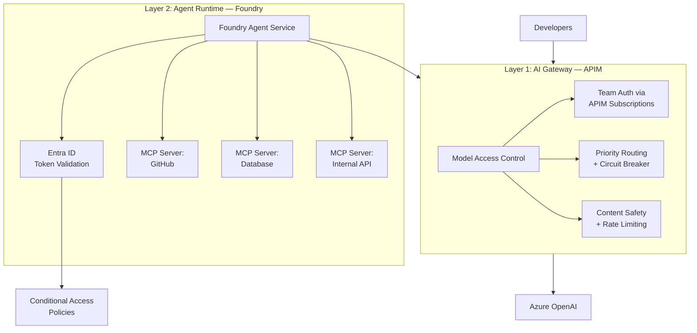
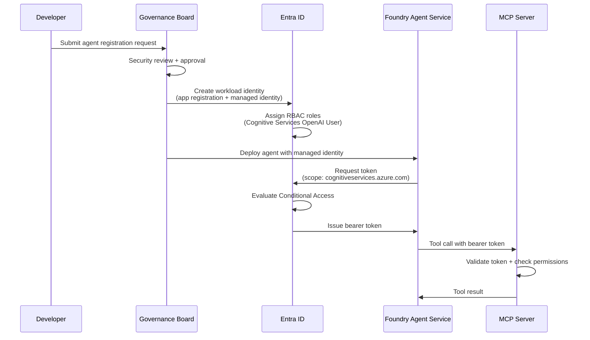

> *We implement the [GenAI Adoption Framework](https://github.com/Odovey-Consulting/genai-adoption-framework) using Azure as the reference platform. The patterns — agent identity, scoped credentials, delegation chains, lifecycle governance — are provider-agnostic. See the framework for the vendor-neutral specification.*

The first three posts in this series covered a complete platform stack: a [gateway foundation](/blog/building-your-genai-platform-foundation) that controls model access via Azure APIM, [operations](/blog/genai-platform-operations-observability-security-devex) that keep the platform visible and secure with Azure Monitor and Sentinel, and a [workload development lifecycle](/blog/genai-workload-development-from-scoping-to-production) that takes features from scoping to production with promptfoo and CI. That stack controls which models teams can call and how. But it assumes a human is driving every request.

When workloads become autonomous agents — calling APIs, querying databases, executing multi-step workflows on behalf of users — a new layer of control is required. The gateway controls model access for developers. Agent identity controls what agents can do with the tools they access.

This post implements **GAF Layer 5 — Agent Security** — the controls required when workloads become autonomous agents: identity, authorization, audit trails, and lifecycle governance. We are progressing from **Stage 2: Operational** (emerging) to **Stage 3: Optimized** (full) and demonstrating three GAF principles: **Least Privilege**, **Human Accountability**, and **Default Deny**.

## Why Agents Need Identity

Agents are not just API calls with a loop. They hold credentials, make decisions across multiple systems, and act with a degree of autonomy that a simple LLM request does not. Without identity controls, four problems emerge quickly:

- **Standing access** — agents accumulate long-lived credentials to production systems with no expiration or rotation. This violates GAF principle **Least Privilege**.
- **No audit trail** — when an agent modifies a database record or calls an external API, there is no link back to the human who authorized the action. This violates GAF principle **Human Accountability** ("every AI action traces back to a named human owner").
- **No revocation** — if an agent is compromised, there is no mechanism to revoke its access across all the tools it touches. This violates GAF principle **Default Deny** (if you cannot revoke, you cannot deny).
- **Shadow agents** — teams deploy agents outside the platform with no visibility into what they are doing. This violates the GAF Layer 5 requirement for an Agent Registry.

## MCP: The Agent-Tool Interface

The Model Context Protocol (MCP) is the emerging standard for how agents communicate with tools. The MCP authorization specification (2025-11-25) uses OAuth 2.1 at the transport layer. Three mechanisms matter for enterprise security:

- **CIMD (Client ID Metadata Documents)** — stateless, web-native client registration where the client's URL is its identity. No pre-registration step required.
- **Resource indicators (RFC 8707)** — tokens are scoped to specific MCP servers, preventing token confusion attacks where a token issued for one server is replayed against another.
- **Enterprise-managed authorization (XAA/ID-JAG)** — admin-controlled agent authorization via your corporate IdP, letting your identity team manage agent permissions through the same IdP they already use for humans.

The honest caveat: authorization is optional in the MCP spec. Many implementations skip it entirely. This is exactly why you need enforcement at the gateway layer — you cannot assume every MCP server in your environment implements auth correctly.

A brief note on A2A (Agent-to-Agent protocol from Google): it provides interoperability hooks for agents to communicate with each other, but security is opt-in, not enforced. Organizations using A2A must layer their own controls.

## Azure AI Foundry Agent Service

Azure AI Foundry Agent Service is the agent runtime. It provides a managed environment for building, deploying, and operating agents with built-in Entra identity integration.

### Identity Lifecycle

During development, agents share a **project-level managed identity** — convenient for iteration but insufficient for production. When an agent is published for production use, it gets a **distinct identity** backed by Microsoft Entra ID.

Agent authentication to MCP servers and downstream services uses **standard Microsoft Entra Bearer Tokens** — OAuth 2.0 scoped to `https://cognitiveservices.azure.com/.default`. This is secretless and Entra-backed. No API keys, no stored credentials.

**Enterprise MCP** provides authenticated MCP server connections for agents running in Foundry. Self-hosted MCP servers (GA) connect through standard Entra authentication. Cloud-hosted MCP Server support via Foundry is in preview — use self-hosted servers for production workloads.



## Entra ID as the Agent Identity Provider

### Workload Identities (GA)

Entra Workload Identities are the production-ready foundation for agent identity:

- **App registrations** — for custom agents built outside Foundry. Each agent gets a unique app registration with its own client ID, secret/certificate, and API permissions.
- **Managed identities** — for Azure-hosted agents. System-assigned or user-assigned managed identities eliminate credential management entirely. The Azure platform handles token issuance and rotation.
- **Federated credentials** — for agents running outside Azure (GitHub Actions, AWS, on-premises). Workload identity federation trusts external identity tokens without storing secrets.

### Entra Agent ID (Frontier — Early Access)

Entra Agent ID introduces a four-tier identity model specifically designed for AI agents:

| Tier | Purpose |
|------|---------|
| **Blueprint** | Template defining agent capabilities and constraints |
| **Blueprint Principal** | The publishable, deployable form of a blueprint |
| **Agent Identity** | The runtime identity of a deployed agent instance |
| **Agent User** | The user-scoped identity when an agent acts on behalf of a specific person |

Entra Agent ID provides auto-discovery of agents from Foundry and Copilot Studio, plus agent-specific risk signals for Conditional Access policies.

**Important:** Entra Agent ID is **Frontier (early access)** — not production GA. There is no SLA. It is expected to reach GA, but the timeline is not confirmed. For production workloads today, use Entra Workload Identities. Plan for Entra Agent ID as the future state.

### Conditional Access for Agents

Entra Conditional Access policies apply to agent identities just as they do to human identities:

- **Block high-risk agents** — agents flagged with elevated risk signals cannot access sensitive resources
- **Restrict by IP/network** — agents can only operate from approved network locations (your Azure VNet, corporate IP ranges)
- **Scope by custom security attributes** — tag agents with attributes like `data-tier: internal` and enforce access restrictions based on those attributes

**Limitation:** Agents do not support device signals or session context — Conditional Access policies for agents should rely on network location, risk signals, and custom attributes rather than device compliance.



This implements the GAF principle **Default Deny** — no agent accesses any tool without explicit Entra authorization. Every step in the sequence requires an explicit grant.

## Fine-Grained Policy with Cedar

Entra Conditional Access handles coarse-grained decisions: can this agent access this resource? Cedar handles the next question: can this agent use this specific parameter value?

Cedar is an open-source policy language developed by AWS with default-deny, forbid-wins semantics well-suited to security policy.

### Tool-level deny — block agent from production database

```cedar
forbid(
  principal == Agent::"ticket-summarizer",
  action == Action::"DatabaseQuery",
  resource == Database::"production-customers"
);
```

### Parameter constraint — refund amount under $200

```cedar
permit(
  principal == Agent::"refund-processor",
  action == Action::"ProcessRefund",
  resource == Service::"payments-api"
) when {
  context.parameters.amount < 200
};
```

### Time-based constraint — business hours only

```cedar
permit(
  principal == Agent::"data-exporter",
  action == Action::"ExportData",
  resource == Service::"analytics-api"
) when {
  context.request_time.hour >= 9 &&
  context.request_time.hour < 17 &&
  context.request_time.dayOfWeek in ["Monday", "Tuesday", "Wednesday", "Thursday", "Friday"]
};
```

### Delegation chain requirement

```cedar
permit(
  principal is Agent,
  action == Action::"ModifyRecord",
  resource == Database::"internal-crm"
) when {
  principal has delegation_chain &&
  principal.delegation_chain.human_owner != "" &&
  principal.delegation_chain.depth <= 2
};
```

This implements the GAF principle **Least Privilege** — Cedar ensures agents get the minimum access required for their current task, down to parameter values. A refund agent can process refunds under $200, during business hours, on approved systems only.

## Audit Pipeline

Every agent action must be traceable back to a human owner. This is the core of GAF principle **Human Accountability**.

### Structured Log Format

Foundry Agent Service emits traces to Application Insights. Structure your log entries to include:

```json
{
  "timestamp": "2026-02-10T14:32:01Z",
  "agent_id": "ticket-summarizer-prod-01",
  "entra_object_id": "a1b2c3d4-e5f6-7890-abcd-ef1234567890",
  "human_owner": "jane.chen@contoso.com",
  "tool_called": "SlackWebhook.postMessage",
  "parameters": {
    "channel": "#support-digest",
    "message_length": 245
  },
  "result_code": 200,
  "delegation_chain_id": "dc-2026-02-10-001",
  "token_usage": {
    "prompt_tokens": 1250,
    "completion_tokens": 89
  }
}
```

### Sentinel Integration

Query all tool calls by a specific agent in the last 24 hours:

```kql
AppTraces
| where TimeGenerated > ago(24h)
| extend AgentId = tostring(customDimensions["agent_id"])
| extend HumanOwner = tostring(customDimensions["human_owner"])
| extend ToolCalled = tostring(customDimensions["tool_called"])
| extend ResultCode = toint(customDimensions["result_code"])
| where AgentId == "ticket-summarizer-prod-01"
| project TimeGenerated, AgentId, HumanOwner, ToolCalled, ResultCode
| order by TimeGenerated desc
```

### Custom Sentinel Analytics Rules

**Anomalous agent behavior — tool calls outside normal pattern:**

```kql
let baseline = AppTraces
    | where TimeGenerated between (ago(7d) .. ago(1d))
    | extend AgentId = tostring(customDimensions["agent_id"])
    | extend ToolCalled = tostring(customDimensions["tool_called"])
    | summarize NormalTools = make_set(ToolCalled) by AgentId;
AppTraces
| where TimeGenerated > ago(1h)
| extend AgentId = tostring(customDimensions["agent_id"])
| extend ToolCalled = tostring(customDimensions["tool_called"])
| join kind=inner baseline on AgentId
| where ToolCalled !in (NormalTools)
| extend AlertTitle = strcat("Agent ", AgentId, " called unusual tool: ", ToolCalled)
```

**Privilege escalation — agent accessing resources outside its scope:**

```kql
AppTraces
| where TimeGenerated > ago(1h)
| extend AgentId = tostring(customDimensions["agent_id"])
| extend ResultCode = toint(customDimensions["result_code"])
| where ResultCode == 403  // access denied
| summarize DeniedCount = count() by AgentId, bin(TimeGenerated, 15m)
| where DeniedCount > 5
| extend AlertTitle = strcat("Potential privilege escalation: ", AgentId,
    " received ", DeniedCount, " access denials in 15 minutes")
```

**A note on Sentinel workbooks:** There is no prebuilt AI agent security workbook in Sentinel. Organizations build custom workbooks using the KQL queries above. This is an ecosystem gap, not a limitation of the detection approach.

## Shadow Agent Discovery

Shadow agents — agents deployed outside the platform without registration — are the agent equivalent of shadow IT. The GAF Layer 5 requirement is clear: "Detecting unregistered autonomous loops."

### Entra Sign-In Logs

Query for unexpected workload identity activity:

```kql
AADServicePrincipalSignInLogs
| where TimeGenerated > ago(7d)
| where ResourceDisplayName contains "cognitiveservices"
    or ResourceDisplayName contains "openai"
| extend AppName = tostring(AppDisplayName)
| where AppName !in ("ticket-summarizer-prod", "code-reviewer-prod", "data-exporter-prod")
| summarize SignInCount = count() by AppName, ServicePrincipalId
| order by SignInCount desc
```

### Periodic Reconciliation

Compare Entra app registrations against your Agent Registry:

1. Export all Entra workload identities with `cognitiveservices` API permissions
2. Compare against the registered agents in your Foundry Agent Service inventory
3. Flag any identity that exists in Entra but not in the registry

Consider **Astrix Security** as a complementary third-party option for shadow agent discovery across multi-cloud environments.

## Agent Identity Landscape

The GAF describes agent identity in terms of capabilities — registry, scoped credentials, delegation chains, lifecycle governance. These concepts apply regardless of which IdP or agent platform you choose.

| Platform | Status | Best For |
|----------|--------|----------|
| **Azure AI Foundry Agent Service** | GA | Agent runtime with automatic Entra identity provisioning |
| **Entra Workload Identities** | GA | Production agent identity — app registrations + managed identities |
| **Entra Agent ID** | Frontier (early access) | Advanced agent lifecycle — blueprints, risk signals, auto-discovery |
| **Auth0 for AI Agents** | GA | User-delegated API access — Token Vault for third-party integrations |
| **CyberArk Secure AI Agents** | GA | Zero standing privileges for infrastructure access |
| **SailPoint Agent Identity** | GA | Governance — access reviews, human ownership binding |
| **Astrix Security** | GA | Shadow agent discovery across environments |

These platforms are complementary, not competing. Foundry provides the runtime. Entra provides identity. Cedar provides fine-grained policy. Sentinel provides audit. CyberArk or SailPoint may provide additional governance for organizations with mature PAM or IGA programs.

## Getting Started (Tiered)

A tiered adoption path that matches investment to risk:

**Tier 1 (weeks):** Register agents as Entra workload identities. Enable MCP connections via Foundry Agent Service with Entra authentication. Configure audit logging to Application Insights and forward to Sentinel. This maps to GAF Stage 2 emerging agent security.

**Tier 2 (1–3 months):** Add Cedar for parameter-level authorization. Implement Conditional Access policies for agent identities — restrict by network, block high-risk agents, scope by custom attributes. Build Sentinel analytics rules for anomalous agent behavior. This maps to GAF Stage 2 full agent security.

**Tier 3 (3–6 months):** Build the full delegation chain audit pipeline — trace user to agent to tool to parameters in Sentinel. Implement quarterly agent access reviews. Deploy shadow agent discovery with Entra sign-in log analysis. Evaluate Entra Agent ID integration if it reaches GA. This maps to GAF Stage 3 optimized agent security.

## Series Closing

The [foundation](/blog/building-your-genai-platform-foundation) (GAF Layers 1–2) gives you governance and a gateway. [Operations](/blog/genai-platform-operations-observability-security-devex) (GAF Layer 3) gives you visibility and security processes. [Workload development](/blog/genai-workload-development-from-scoping-to-production) (GAF Layer 4) gives you quality and safety. Agent identity (this post, GAF Layer 5) gives you control over what your AI systems can do autonomously.

All five GAF layers now have concrete Azure implementations:

| GAF Layer | Azure Implementation |
|-----------|---------------------|
| Layer 1: Governance | AUP template, data classification mapping, APIM Products |
| Layer 2: Gateway | APIM with `llm-token-limit`, `llm-content-safety`, `llm-emit-token-metric` |
| Layer 3: Operations | Azure Monitor, Managed Grafana (Dashboard 24039), Sentinel, KQL |
| Layer 4: Workloads | promptfoo with `azure:chat` provider, GitHub Actions CI |
| Layer 5: Agent Security | Foundry Agent Service, Entra Workload Identities, Cedar, Sentinel |

The common thread across all four posts: generative AI is software engineering with a probabilistic component. The same disciplines that make traditional software reliable — clear requirements, structured testing, observability, security boundaries, identity management — apply here, with new tools for new problems.

Start with the gateway. Add operations. Build workloads. Secure your agents. Each layer builds on the one before it.
