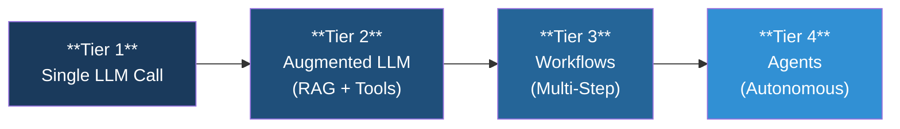
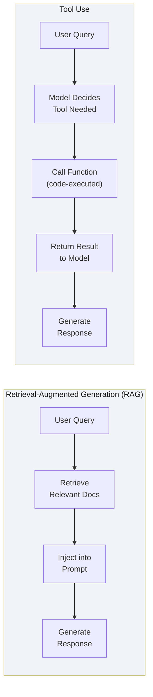
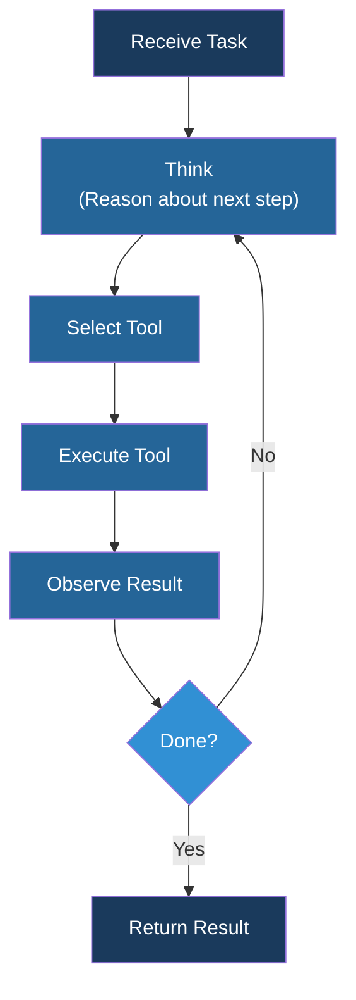
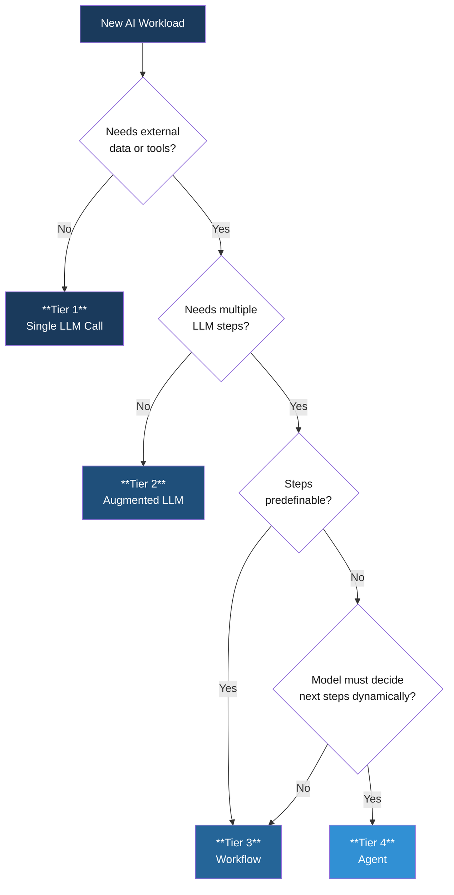

## The Complexity Trap

Most organizations building with generative AI jump straight to agents. The demo looked impressive, the vendor said "autonomous," and suddenly the roadmap calls for a multi-agent system to classify support tickets.

The industry has a name for this: **complexity bias** — the tendency to favor complex solutions over simple ones, even when simpler solutions perform as well or better. In AI workloads, complexity bias is expensive. Every tier of complexity you add increases cost, latency, failure surface, and the difficulty of evaluation. If a single LLM call solves your problem, wrapping it in an agent loop does not make it better — it makes it slower, harder to debug, and more likely to fail in production.

There is a well-established spectrum of AI workload patterns, and it has been independently described by Anthropic, OpenAI, Berkeley, and LangChain. Each tier adds capability, but each tier also adds cost. The right tier depends on your problem, not on what looks most impressive in a demo.

This post walks through the four-tier AI workload spectrum — from a single prompt to fully autonomous agents — with a decision framework for picking the right pattern. The taxonomy draws primarily from Anthropic's "[Building Effective Agents](https://www.anthropic.com/engineering/building-effective-agents)" framework, with supporting perspectives from OpenAI, Berkeley, and LangChain. The central principle is the same one every major AI lab recommends: **start simple, and add complexity only when you can demonstrate that simpler approaches fall short.**

---

## The Four-Tier Spectrum

Before diving into each tier, here is the full picture. The spectrum moves from simple, fast, and predictable on the left to capable, flexible, and expensive on the right.



**← Simpler, faster, cheaper, more predictable** · · · **More capable, more flexible, more expensive →**

| Tier | Pattern | Control Flow | When to Use | Cost Profile |
|------|---------|-------------|-------------|--------------|
| **1** | Single LLM Call | None | Classification, summarization, extraction, translation | Lowest — one API call |
| **2** | Augmented LLM | Code-driven, single turn | Needs external data or tool access | Low — retrieval + one call |
| **3** | Workflows | Code-driven, multi-step | Multiple LLM steps through predefined paths | Medium — multiple calls, orchestration logic |
| **4** | Agents | Model-driven | Dynamic decision-making, open-ended tasks | Highest — unbounded calls, tool use, retries |

The key insight: **the right tier is the simplest one that solves your problem.** Every major AI lab — Anthropic, OpenAI, Google — publishes the same recommendation. Start simple. Add complexity only when you can demonstrate that the simpler tier is insufficient. This is not a platitude; it is an engineering discipline.

---

## Tier 1 — Single LLM Call

One prompt in, one response out. No tools, no retrieval, no state. The model receives your input, applies its training, and returns a result.

This is the most underestimated tier. Most production AI workloads are Tier 1. This is not a limitation — it is a feature. Single calls are fast, cheap, deterministic (at temperature 0), easy to evaluate, and easy to debug. If your problem can be solved with a well-crafted prompt and structured output, you are done.

**Common use cases:** text classification, document summarization, content generation, data extraction from unstructured text, translation, sentiment analysis, and format conversion.

### Example: Ticket Classification

```python
from openai import OpenAI

client = OpenAI()  # Works with OpenAI, Azure OpenAI, and compatible APIs

def classify_ticket(ticket_text: str) -> str:
    response = client.chat.completions.create(
        model="gpt-4o",
        temperature=0,
        messages=[
            {
                "role": "system",
                "content": (
                    "You are a support ticket classifier. "
                    "Classify the ticket into exactly one category: "
                    "billing, technical, account, or general. "
                    "Respond with only the category name."
                ),
            },
            {"role": "user", "content": ticket_text},
        ],
    )
    return response.choices[0].message.content.strip().lower()

category = classify_ticket("I was charged twice for my subscription last month.")
print(category)  # billing
```

This is a complete, production-ready pattern. It needs no framework, no orchestration layer, and no agent runtime. If your classification accuracy is sufficient with prompt engineering alone, this is the right answer.

**When to move up:** your problem requires external data the model was not trained on, or the model needs to take actions in external systems. That is Tier 2.

---

## Tier 2 — Augmented LLM (RAG + Tools)

Still a single turn, but enriched with external context or tool access. The model gets help — either from retrieved documents or from functions it can call — but the control flow remains code-driven. Your application decides when and how to augment the model.

There are two sub-patterns:



**RAG (Retrieval-Augmented Generation)** retrieves relevant documents from a vector store or search index, injects them into the prompt as context, and lets the model generate a grounded response. The retrieval step is code-controlled — you decide what to search, how many results to include, and how to format them.

**Tool Use** lets the model call predefined functions during generation. The model outputs a structured tool call (function name + arguments), your code executes it, and the result is fed back to the model. The critical distinction from agents: your code controls which tools are available and the overall flow. The model decides *whether* to call a tool within a single turn, but not what happens next.

Tool access is where the **Model Context Protocol (MCP)** becomes relevant. MCP standardizes how AI applications connect to tools and data sources, replacing custom integrations with a universal protocol. If you are building tool-augmented LLM applications, MCP eliminates the need to write bespoke connectors for each tool. For a full explanation, see [What Is MCP? The Model Context Protocol Explained](/blog/what-is-mcp-the-model-context-protocol-explained).

**When to move up:** your problem requires multiple LLM calls in sequence, where the output of one step feeds the next. That is Tier 3.

---

## Tier 3 — Workflows (Code-Controlled Multi-Step)

Workflows combine multiple LLM calls through predefined, developer-controlled paths. You write the control flow — what happens in what order, how steps connect, and when to stop. The model handles each individual step, but the orchestration is yours.

This is the sweet spot for most complex AI work. Workflows give you the power of multi-step reasoning with the predictability of deterministic control flow. Anthropic's framework identifies five sub-patterns:

```mermaid
flowchart TB
    subgraph Chain["Prompt Chaining"]
        direction LR
        C1["Step 1:\nExtract"] --> C2["Step 2:\nSummarize"] --> C3["Step 3:\nTranslate"]
    end

    subgraph Route["Routing"]
        direction LR
        R1["Classify\nInput"] --> R2{"Type?"}
        R2 -->|Billing| R3["Billing\nHandler"]
        R2 -->|Technical| R4["Technical\nHandler"]
        R2 -->|General| R5["General\nHandler"]
    end

    subgraph Par["Parallelization"]
        direction LR
        P1["Input"] --> P2["Check Bugs"]
        P1 --> P3["Check Style"]
        P1 --> P4["Check Security"]
        P2 --> P5["Aggregate\nResults"]
        P3 --> P5
        P4 --> P5
    end

    subgraph Orch["Orchestrator-Workers"]
        direction LR
        O1["Orchestrator\n(Plan)"] --> O2["Worker 1"]
        O1 --> O3["Worker 2"]
        O1 --> O4["Worker 3"]
        O2 --> O5["Synthesize"]
        O3 --> O5
        O4 --> O5
    end

    subgraph Eval["Evaluator-Optimizer"]
        direction LR
        E1["Generate"] --> E2["Evaluate"]
        E2 -->|"Below\nThreshold"| E1
        E2 -->|"Meets\nThreshold"| E3["Output"]
    end

    style Chain fill:#f0f4f8,color:#1a1a1a
    style Route fill:#f0f4f8,color:#1a1a1a
    style Par fill:#f0f4f8,color:#1a1a1a
    style Orch fill:#f0f4f8,color:#1a1a1a
    style Eval fill:#f0f4f8,color:#1a1a1a
```



**Prompt Chaining** — sequential steps where the output of step N becomes the input to step N+1. Each step can have its own system prompt, model, and temperature. Use this when your task decomposes cleanly into discrete, ordered subtasks. Example: extract key facts from a document, summarize them, then translate the summary.

**Routing** — classify the input, then dispatch to a specialized handler. The classifier is typically a fast, cheap model (or even a rule-based filter), while the handlers can be more powerful models with domain-specific prompts. Example: a support system that routes billing questions, technical issues, and general inquiries to different prompt pipelines.

**Parallelization** — run independent tasks concurrently and aggregate the results. Each branch processes the same input with a different focus. Example: a code review system that checks for bugs, style violations, and security issues simultaneously, then combines the findings.

**Orchestrator-Workers** — a central LLM analyzes the task, breaks it into subtasks, delegates to worker LLMs, and synthesizes their outputs. Unlike parallelization, the orchestrator dynamically decides what the subtasks are. Example: a code review that first identifies which files need attention, then dispatches per-file reviews to workers.

**Evaluator-Optimizer** — a generate-evaluate loop. One LLM generates output, another evaluates it against criteria, and if the output falls short, the generator tries again with the evaluation feedback. Example: marketing copy that must meet brand guidelines — generate, score against the guidelines, refine until the threshold is met.

### Example: Two-Step Prompt Chain

```python
from openai import OpenAI

client = OpenAI()

def extract_and_summarize(document: str) -> str:
    # Step 1: Extract key facts
    extraction = client.chat.completions.create(
        model="gpt-4o",
        temperature=0,
        messages=[
            {
                "role": "system",
                "content": (
                    "Extract the key facts from this document as a "
                    "bullet-point list. Include dates, names, numbers, "
                    "and decisions. Nothing else."
                ),
            },
            {"role": "user", "content": document},
        ],
    )
    key_facts = extraction.choices[0].message.content

    # Step 2: Summarize the extracted facts
    summary = client.chat.completions.create(
        model="gpt-4o",
        temperature=0.3,
        messages=[
            {
                "role": "system",
                "content": (
                    "Write a three-sentence executive summary from these "
                    "key facts. Be concise and focus on decisions and outcomes."
                ),
            },
            {"role": "user", "content": key_facts},
        ],
    )
    return summary.choices[0].message.content

result = extract_and_summarize(long_document)
print(result)
```

This is still plain Python with no framework. The control flow is explicit: step 1 runs, its output feeds step 2, and you get a deterministic two-step pipeline. You can add logging, validation, and error handling between steps. You can swap models for different steps. You can test each step independently.

**When to move up:** the model needs to decide its own next steps dynamically — choosing which tools to use, in what order, and when to stop. That is Tier 4. But verify first — most problems that feel like they need an agent are actually workflows with well-defined steps. If you can write the control flow as code, it is a workflow, not an agent.

---

## Tier 4 — Agents (Model-Controlled Autonomy)

In an agent, the model controls the execution flow. It decides which tools to call, in what order, and when to stop. The developer provides the tools, the system prompt, and the guardrails — but the model writes the control logic at runtime.

The critical distinction: **in a workflow, the developer writes the control flow. In an agent, the model writes the control flow.**



This is the **reason-act-observe loop**. The model receives a task, reasons about what to do next, selects and executes a tool, observes the result, and decides whether to continue or stop. Each iteration is an LLM call, and the number of iterations is not predetermined — the model decides when it has enough information to return a result.

Agents come in three sub-patterns:

- **Single agent** — one model with access to a set of tools, running the loop until the task is complete. Most production agents are this pattern.
- **Multi-agent (manager)** — a central agent delegates subtasks to specialized agents and synthesizes their results. The manager controls the overall workflow while agents handle domain-specific tasks.
- **Multi-agent (decentralized)** — peer agents communicate directly with each other, each managing its own domain. No central coordinator. This is the most complex pattern and is rarely needed.

### Trade-Offs

Agents are the most capable pattern, but they carry real costs:

- **Higher expense** — an agent may make 10, 20, or 50 LLM calls to complete a task that a workflow handles in 3. Each call costs money and adds latency.
- **Harder to evaluate** — workflows produce consistent outputs for the same inputs. Agents may take different paths each time, making systematic evaluation difficult.
- **Harder to debug** — when an agent fails, you need to trace through a variable-length chain of reasoning steps to find where it went wrong.
- **Compounding errors** — each step in the loop can introduce errors. In a 20-step agent run, a small error rate per step compounds into a meaningful failure rate overall.
- **Harder to observe** — monitoring agent behavior requires tracing infrastructure that captures every tool call, every reasoning step, and every decision point.

These are not reasons to avoid agents — they are reasons to use agents only when the problem genuinely requires model-controlled autonomy. If your use case involves open-ended research, complex multi-tool interactions where the path cannot be predetermined, or tasks where the number and type of steps vary significantly across inputs, agents are the right pattern.

For a detailed look at how to secure agents in production — identity, authorization, audit, and least-privilege controls — see [Securing AI Agents in the Enterprise](/blog/securing-ai-agents-in-the-enterprise).

---

## The Decision Framework

When you have a new AI workload, use this framework to select the right tier. Start at the top and move down only when the answer pushes you further.



Walk through it:

1. **Does the task need external data or tool access?** If the model's training data is sufficient and it does not need to call any APIs or databases, a single LLM call (Tier 1) is your answer. Classification, summarization, translation, and format conversion almost always live here.

2. **Does the task need multiple LLM steps?** If one retrieval or tool call plus one generation step is enough, you are at Tier 2. A RAG pipeline that retrieves documents and generates a grounded answer is Tier 2. A tool-augmented call that checks a database and responds is Tier 2.

3. **Can you predefine the steps?** If you can write the control flow — step 1 does this, step 2 does that, results combine like so — it is a workflow (Tier 3). Most multi-step AI problems have well-defined steps, even if the content of each step varies.

4. **Must the model decide its own next steps dynamically?** Only if the path through the task genuinely cannot be predetermined — if the model needs to reason about what to do next based on intermediate results, and different inputs require fundamentally different sequences of actions — do you need an agent (Tier 4).

The most common mistake is jumping to Tier 4 when Tier 3 would work. If you find yourself building an agent, pause and ask: could I write this as a workflow with explicit steps? If the answer is yes, even partially, start with the workflow. You can always promote it later.

This post covers **pattern selection** — choosing which workload type fits your problem. For the **development process** that follows — scoping, prompt engineering, evaluation, adversarial testing, and CI/CD — see [GenAI Workload Development: From Scoping to Production](/blog/genai-workload-development-from-scoping-to-production). For the broader organizational framework that encompasses both, see the [GenAI Adoption Framework](/blog/introducing-the-genai-adoption-framework).

---

## Closing

Agents get the headlines, but workflows do the work. The vast majority of production AI value comes from Tier 1 and Tier 3 — single calls with well-crafted prompts and multi-step workflows with explicit control flow.

Audit your current AI workloads. For each one, identify the actual tier it needs. If you have an agent that follows the same steps every time, it is a workflow wearing an agent costume — simplify it. If you have a brittle multi-step pipeline that should be adapting to its inputs, consider whether an agent loop would be more robust.

Whichever tier you choose, the disciplines are the same: scope clearly, evaluate rigorously, monitor continuously, and start simpler than you think you need to.
