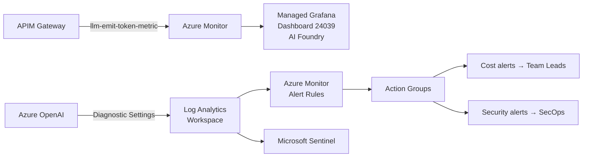
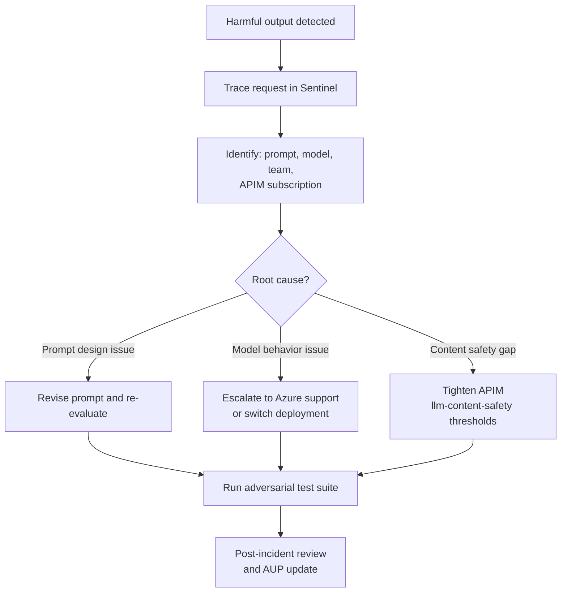

> *We implement the [GenAI Adoption Framework](https://github.com/Odovey-Consulting/genai-adoption-framework) using Azure as the reference platform. The patterns — structured telemetry, cost attribution, security event triage — are provider-agnostic. See the framework for the vendor-neutral specification.*

Your [AI gateway is deployed](/blog/building-your-genai-platform-foundation). Azure API Management is tracking tokens, enforcing budgets, routing requests across regions. But a running gateway is not a mature platform. Three categories of ongoing work remain that no gateway handles for you: **observability**, **security operations**, and **developer enablement**.

This post implements **GAF Layer 3 — Operations** — the three reinforcing categories that turn a deployed gateway into a managed platform. We are targeting **Stage 2: Operational** (8–16 weeks) and demonstrating three GAF principles: **Observability by Design**, **Tight Feedback Loops**, and **Automate Enforcement, Humanize Judgment**.

## Observability: Azure Monitor + Managed Grafana

The gateway emits raw data — token counts, latencies, error codes. The operational work is deciding what to do with it: which metrics to alert on, how to route those alerts, and how to turn usage data into cost governance conversations with team leads.



### Diagnostic Settings (Bicep)

Send Azure OpenAI logs and metrics to your Log Analytics workspace:

```bicep
resource diagnosticSettings 'Microsoft.Insights/diagnosticSettings@2021-05-01-preview' = {
  name: 'aoai-diagnostics'
  scope: aoaiPrimary
  properties: {
    workspaceId: logAnalyticsWorkspace.id
    logs: [
      { categoryGroup: 'allLogs' enabled: true }
    ]
    metrics: [
      { category: 'AllMetrics' enabled: true }
    ]
  }
}

resource grafana 'Microsoft.Dashboard/grafana@2023-09-01' = {
  name: 'grafana-ai-platform'
  location: 'eastus'
  sku: { name: 'Standard' }
  identity: { type: 'SystemAssigned' }
  properties: {
    grafanaIntegrations: {
      azureMonitorWorkspaceIntegrations: [
        { azureMonitorWorkspaceResourceId: azureMonitorWorkspace.id }
      ]
    }
  }
}
```

After deploying Managed Grafana, import the prebuilt **AI Foundry dashboard** (ID 24039). It visualizes `TokenTransaction`, `AzureOpenAIRequests`, `ProcessedPromptTokens`, and `GeneratedTokens` out of the box.

This connects to the GAF principle **Observability by Design** — every layer emits structured telemetry from day one. This is not optional. If you cannot query token usage by team by model by day, your platform is flying blind.

### Key Metrics

| Metric | Azure Monitor Signal | Why It Matters |
|--------|---------------------|----------------|
| Token throughput | `TokenTransaction` (by deployment) | Capacity planning and cost forecasting |
| Cost per request | Calculated: tokens × model pricing | Budget enforcement and chargeback |
| Time to first token | `AzureOpenAIRequests` duration percentiles | User-perceived responsiveness for streaming UIs |
| Error rate | `AzureOpenAIRequests` filtered by `StatusCode` | Provider health and misconfiguration detection |
| Guardrail trigger rate | Content Safety diagnostic logs | Governance effectiveness and false-positive tuning |

## KQL Queries for Key Metrics

These are runnable queries against your Log Analytics workspace. Copy them into your workbook or alert rules.

**Token usage by deployment over time:**

```kql
AzureMetrics
| where ResourceProvider == "MICROSOFT.COGNITIVESERVICES"
| where MetricName == "TokenTransaction"
| summarize TotalTokens = sum(Total) by bin(TimeGenerated, 1h), Resource
| render timechart
```

**Error rate breakdown:**

```kql
AzureDiagnostics
| where ResourceProvider == "MICROSOFT.COGNITIVESERVICES"
| where Category == "RequestResponse"
| summarize
    Total = count(),
    Errors = countif(ResultSignature startswith "4" or ResultSignature startswith "5"),
    Throttled = countif(ResultSignature == "429")
    by bin(TimeGenerated, 1h), Resource
| extend ErrorRate = round(100.0 * Errors / Total, 2)
| extend ThrottleRate = round(100.0 * Throttled / Total, 2)
```

**Latency percentiles (p50/p90/p99):**

```kql
AzureDiagnostics
| where ResourceProvider == "MICROSOFT.COGNITIVESERVICES"
| where Category == "RequestResponse"
| summarize
    p50 = percentile(DurationMs, 50),
    p90 = percentile(DurationMs, 90),
    p99 = percentile(DurationMs, 99)
    by bin(TimeGenerated, 1h), Resource
```

**429 throttling events:**

```kql
AzureDiagnostics
| where ResourceProvider == "MICROSOFT.COGNITIVESERVICES"
| where ResultSignature == "429"
| summarize ThrottleCount = count() by bin(TimeGenerated, 15m), Resource, CallerIPAddress
| order by ThrottleCount desc
```

**Cost attribution by model deployment:**

```kql
AzureMetrics
| where ResourceProvider == "MICROSOFT.COGNITIVESERVICES"
| where MetricName == "TokenTransaction"
| extend ModelDeployment = tostring(split(Resource, "/")[-1])
| summarize TotalTokens = sum(Total) by ModelDeployment, bin(TimeGenerated, 1d)
| extend EstimatedCost = case(
    ModelDeployment contains "gpt-4o-mini", TotalTokens * 0.00000015,
    ModelDeployment contains "gpt-4o", TotalTokens * 0.0000025,
    TotalTokens * 0.000001 // default estimate
)
```

## Alerting: Azure Monitor Alert Rules

Replace Prometheus YAML with Azure-native alert rules. These fire automatically; humans decide the response — implementing the GAF principle **Automate Enforcement, Humanize Judgment**.

### Token consumption exceeding threshold

```bicep
resource tokenAlert 'Microsoft.Insights/metricAlerts@2018-03-01' = {
  name: 'alert-token-consumption-high'
  location: 'global'
  properties: {
    description: 'Token consumption exceeds 80% of daily allocation'
    severity: 2
    enabled: true
    scopes: [ aoaiPrimary.id ]
    evaluationFrequency: 'PT15M'
    windowSize: 'PT1H'
    criteria: {
      'odata.type': 'Microsoft.Azure.Monitor.SingleResourceMultipleMetricCriteria'
      allOf: [
        {
          name: 'HighTokenUsage'
          metricName: 'TokenTransaction'
          operator: 'GreaterThan'
          threshold: 800000  // 80% of 1M daily allocation
          timeAggregation: 'Total'
        }
      ]
    }
    actions: [ { actionGroupId: costAlertActionGroup.id } ]
  }
}
```

### High 429 throttle rate

```bicep
resource throttleAlert 'Microsoft.Insights/metricAlerts@2018-03-01' = {
  name: 'alert-high-throttle-rate'
  location: 'global'
  properties: {
    description: 'More than 50 throttled requests in 15 minutes'
    severity: 1
    enabled: true
    scopes: [ aoaiPrimary.id ]
    evaluationFrequency: 'PT5M'
    windowSize: 'PT15M'
    criteria: {
      'odata.type': 'Microsoft.Azure.Monitor.SingleResourceMultipleMetricCriteria'
      allOf: [
        {
          name: 'HighThrottleRate'
          metricName: 'AzureOpenAIRequests'
          operator: 'GreaterThan'
          threshold: 50
          timeAggregation: 'Total'
          dimensions: [
            { name: 'StatusCode' operator: 'Include' values: [ '429' ] }
          ]
        }
      ]
    }
    actions: [ { actionGroupId: securityAlertActionGroup.id } ]
  }
}
```

### Action Group configuration

Route cost alerts to team leads and security alerts to SecOps:

```bicep
resource costAlertActionGroup 'Microsoft.Insights/actionGroups@2023-09-01-preview' = {
  name: 'ag-genai-cost-alerts'
  location: 'global'
  properties: {
    groupShortName: 'GenAICost'
    enabled: true
    emailReceivers: [
      { name: 'TeamLeads' emailAddress: 'genai-team-leads@odovey.com' }
    ]
  }
}

resource securityAlertActionGroup 'Microsoft.Insights/actionGroups@2023-09-01-preview' = {
  name: 'ag-genai-security-alerts'
  location: 'global'
  properties: {
    groupShortName: 'GenAISec'
    enabled: true
    emailReceivers: [
      { name: 'SecOps' emailAddress: 'secops@odovey.com' }
    ]
  }
}
```

## Cost Governance

Cost governance is more than alerts. It is the feedback loop between usage data, model selection, and prompt design decisions — implementing the GAF principle **Tight Feedback Loops**.

**Per-team monthly cost breakdown using APIM subscription dimensions:**

```kql
customMetrics
| where name == "Token Usage"
| extend Team = tostring(customDimensions["Team"])
| extend Model = tostring(customDimensions["Model"])
| summarize TotalTokens = sum(valueSum) by Team, Model, bin(timestamp, 1d)
| extend EstimatedCost = case(
    Model contains "gpt-4o-mini", TotalTokens * 0.00000015,
    Model contains "gpt-4o", TotalTokens * 0.0000025,
    Model contains "o3-mini", TotalTokens * 0.0000011,
    TotalTokens * 0.000001
)
| summarize MonthlyCost = sum(EstimatedCost) by Team, Model
| order by MonthlyCost desc
```

Complement KQL cost queries with **Azure Cost Management resource tags**. Tag every Azure OpenAI instance and APIM subscription with `Team` and `CostCenter` to enable native cost attribution without custom queries.

This connects to the GAF cross-cutting concern **Risk Management** — cost overrun is an operational risk. Untracked spend is a governance failure.

## Security Operations: Microsoft Sentinel

Sentinel is your SIEM for AI security events. It ingests Azure OpenAI diagnostic logs via the Log Analytics workspace that is already receiving your diagnostic data.

### Sentinel Detection Rules (KQL)

**Rate limit abuse — single identity exceeding throttle threshold:**

```kql
AzureDiagnostics
| where ResourceProvider == "MICROSOFT.COGNITIVESERVICES"
| where ResultSignature == "429"
| summarize ThrottleCount = count() by CallerIPAddress, bin(TimeGenerated, 5m)
| where ThrottleCount > 20
| extend AlertTitle = strcat("Rate limit abuse from ", CallerIPAddress)
```

**Anomalous token consumption — sudden spike from a single deployment:**

```kql
let baseline = AzureMetrics
    | where MetricName == "TokenTransaction"
    | where TimeGenerated between (ago(7d) .. ago(1d))
    | summarize AvgTokens = avg(Total) by Resource;
AzureMetrics
| where MetricName == "TokenTransaction"
| where TimeGenerated > ago(1h)
| summarize CurrentTokens = sum(Total) by Resource
| join kind=inner baseline on Resource
| where CurrentTokens > AvgTokens * 3
| extend AlertTitle = strcat("Anomalous token spike: ", Resource)
```

**Unusual source IP patterns:**

```kql
AzureDiagnostics
| where ResourceProvider == "MICROSOFT.COGNITIVESERVICES"
| where TimeGenerated > ago(24h)
| summarize RequestCount = count(), DistinctOperations = dcount(OperationName)
    by CallerIPAddress
| where RequestCount > 100 and CallerIPAddress !in ("known-ip-1", "known-ip-2")
| extend AlertTitle = strcat("Unusual IP activity: ", CallerIPAddress)
```

### Incident Response

When a model produces harmful, biased, or factually dangerous output, you need a response playbook:



**A note on Sentinel workbooks:** There is no prebuilt AI Security workbook in Sentinel. Organizations build custom workbooks tailored to their threat model using the KQL queries above as building blocks. This is a gap in the ecosystem, not a limitation of the approach.

Sentinel logs are the primary compliance artifact — connecting to the GAF cross-cutting concern **Compliance and Regulatory Mapping**. When an auditor asks "can you prove that confidential data never reached a public model endpoint," the answer is a Sentinel query, not a manual investigation.

## Developer Enablement

The gateway gives you a developer portal, dashboards, and subscription management. The operational challenge is making developers actually use the platform.

### Onboarding Checklist

A new team's path to their first production call:

1. **Get an APIM subscription** — request access to a Product tier through the APIM developer portal
2. **Read the AUP** — acknowledge the Acceptable Use Policy
3. **Test in the developer portal** — use APIM's built-in test console to make a first call
4. **Make a streaming call** — run the example below from their development environment
5. **Set up cost alerts** — configure notification for their team's budget threshold

### First Call: Python Through APIM

```python
import httpx

APIM_GATEWAY = "https://apim-ai-gateway.azure-api.net/openai/deployments/gpt-4o/chat/completions"
SUBSCRIPTION_KEY = "your-apim-subscription-key"  # from APIM developer portal

with httpx.stream(
    "POST",
    APIM_GATEWAY,
    headers={
        "Ocp-Apim-Subscription-Key": SUBSCRIPTION_KEY,
        "Content-Type": "application/json",
        "api-version": "2024-10-21",
    },
    json={
        "messages": [{"role": "user", "content": "Summarize this quarter's results."}],
        "stream": True,
    },
    timeout=60.0,
) as response:
    for line in response.iter_lines():
        if line.startswith("data: ") and line != "data: [DONE]":
            print(line[6:], end="", flush=True)
```

This is deliberately simple. The developer does not need to know which Azure region serves their request, how failover works, or where the logs go. The gateway handles all of that. If this first call takes more than five minutes to get working, your onboarding process has a problem.

**GAF Stage 2 exit criteria addressed:** Developer self-service operational — at least 80% of new key requests fulfilled without manual intervention.

## The Operational Flywheel

Observability surfaces problems. Security operations keep the blast radius small when problems occur. Developer enablement makes sure teams are building on the platform instead of around it. These three concerns reinforce each other: better observability catches security anomalies earlier, tighter security reduces the incidents that erode developer trust, and higher developer adoption gives you richer observability data.

### Stage 2 Exit Criteria Checklist

Before moving to [workload development](/blog/genai-workload-development-from-scoping-to-production), verify you have met the GAF Stage 2: Operational exit criteria for Layer 3:

- [ ] Observability dashboards live (Managed Grafana with AI Foundry dashboard)
- [ ] Cost dashboards available for every active team (within 5% of provider invoices)
- [ ] At least four consecutive weekly security reviews conducted (Sentinel)
- [ ] Developer self-service for APIM subscriptions operational
- [ ] KQL queries producing per-team cost attribution data
- [ ] Alert rules configured for token consumption, throttling, and security events

In the [next post](/blog/genai-workload-development-from-scoping-to-production), we shift from platform to workloads: implementing GAF Layer 4 — how to scope, build, evaluate, and ship a generative AI feature from idea to production using promptfoo and GitHub Actions CI. Then in the [final post](/blog/securing-ai-agents-in-the-enterprise), we implement GAF Layer 5 — what happens when those workloads become autonomous agents that need their own identity and authorization controls.
