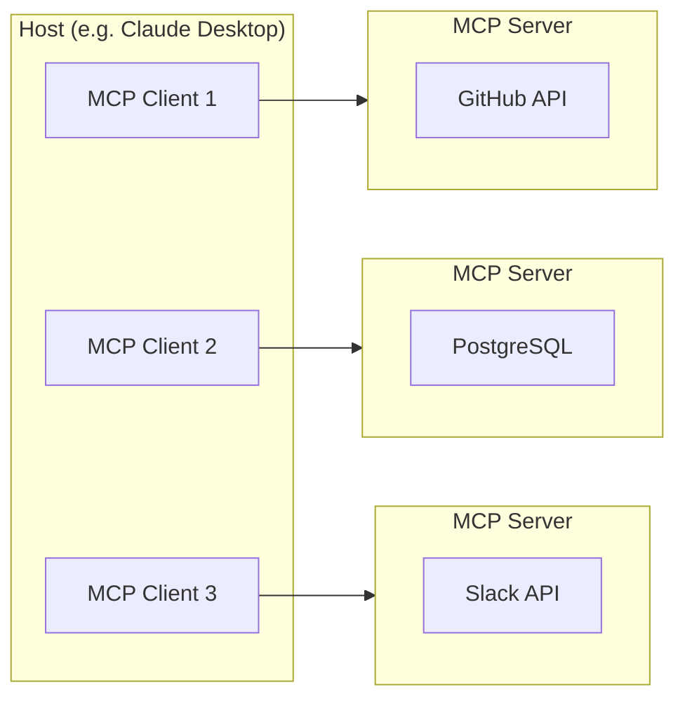
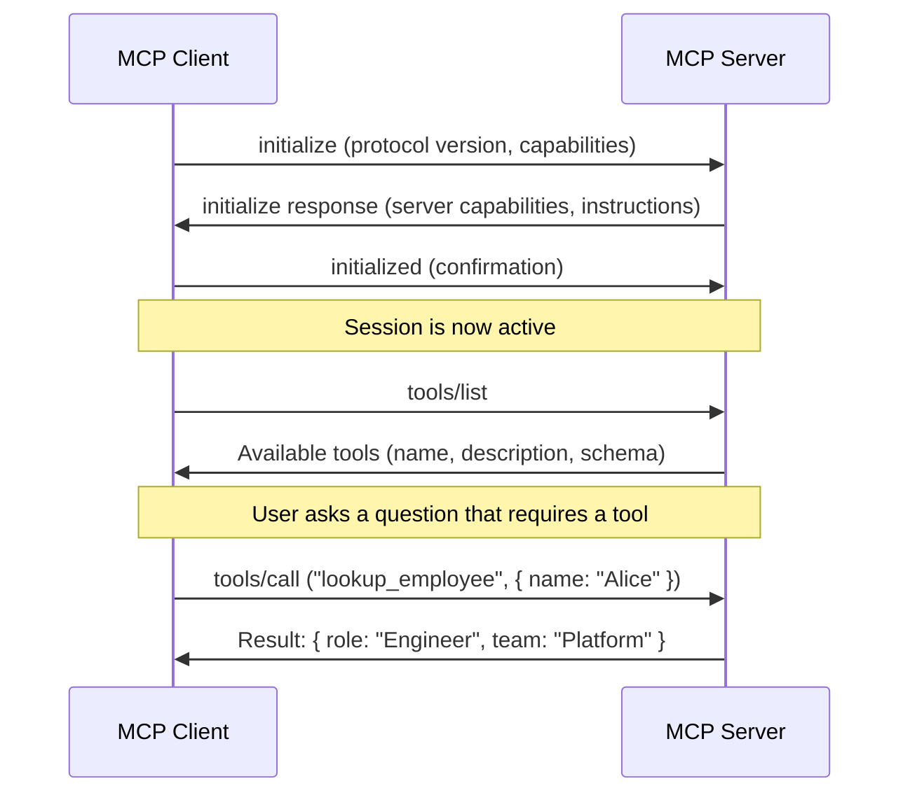
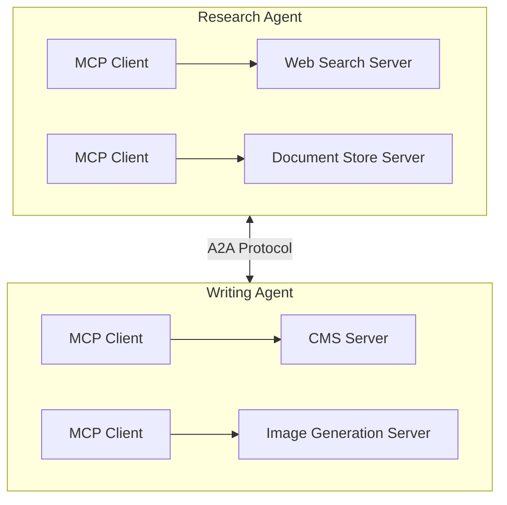

## The Integration Problem

Every AI application eventually needs to connect to the outside world. Databases, APIs, file systems, SaaS platforms, internal tools — the moment an AI model needs to do something useful, it needs access to something it was not trained on.

Before MCP, every one of these connections was custom. If you wanted Claude to query your database, you wrote a bespoke integration. If you then wanted GPT to query the same database, you wrote another one. Each AI model needed its own connector to each tool. This is the N×M problem: N models multiplied by M tools equals N×M custom integrations, each with its own authentication, error handling, and maintenance burden.

The **Model Context Protocol (MCP)** solves this by providing a universal, open standard for connecting AI models to tools and data. Think of it as USB-C for AI. Before USB-C, every device had its own proprietary charger. USB-C gave us one connector that works everywhere. MCP does the same for AI integrations — build one MCP server for your tool, and every MCP-compatible AI application can use it. The N×M problem becomes N+M.

MCP was created by Anthropic and released as an open-source specification in November 2024. Governance has since moved to the **Agentic AI Foundation** under the Linux Foundation, with OpenAI, Google, Microsoft, AWS, and Cloudflare as founding members. The protocol has reached significant adoption: over 97 million monthly SDK downloads, more than 17,000 community-built servers, and integration into every major AI platform.

This post explains what MCP is, why it matters for your business, and how it works under the hood. The first half is written for executives and decision-makers. The second half goes deep on architecture, security, and code.

---

## Why Executives Should Care

If you are evaluating AI platforms, building AI-powered applications, or deciding how to expose internal systems to AI, MCP directly affects your strategy.

**Vendor portability.** MCP is vendor-neutral. An MCP server you build today works with Claude, ChatGPT, Gemini, GitHub Copilot, and any other MCP-compatible client. You are not locked into a single AI provider. If you switch models next year, your integrations carry over unchanged.

**Reduced integration cost.** Without MCP, every AI tool your organization adopts needs its own integrations to your internal systems. With MCP, you build one server per internal system and every AI application in your organization can use it. This is the difference between maintaining dozens of point-to-point connectors and maintaining a handful of reusable ones.

**Governance and security.** MCP includes a built-in authorization framework based on OAuth 2.1. Enterprise MCP gateways provide centralized policy enforcement, audit trails, and rate limiting across all agent-to-tool connections. Every tool invocation is structured and logged — there is no ambiguity about what an AI agent accessed or did.

**Future-proofing.** With Linux Foundation governance and adoption from every major AI vendor, MCP is not a proprietary bet. Building integrations on MCP is a safe investment that will not strand your engineering work if the AI landscape shifts.

**Regulatory alignment.** The EU AI Act takes effect in August 2026 and requires documented governance for AI systems that access enterprise data. MCP's structured protocol — with typed tool definitions, scoped permissions, and auditable invocations — makes compliance demonstrably easier than ad-hoc integrations.

The short version: MCP reduces cost, eliminates vendor lock-in, and gives you a governable integration layer for AI. If your AI strategy does not include MCP, it is already behind.

---

## How MCP Works — Architecture Overview

MCP follows a client-server architecture with three distinct roles.



- **Host** — The AI application the user interacts with (Claude Desktop, Cursor, a custom agent). The host creates and manages one or more MCP clients.
- **Client** — A connector inside the host that maintains a one-to-one connection with an MCP server. Each client handles protocol negotiation, capability exchange, and message routing for its server.
- **Server** — A lightweight program that exposes specific capabilities through MCP. Each server connects to one external system (a database, an API, a file system) and presents it through standardized primitives.

### The Three Primitives

MCP defines three types of capabilities that servers can expose:

| Primitive | Controlled By | Purpose | Example |
|-----------|--------------|---------|---------|
| **Tools** | Model | Actions the AI can invoke | "Create a Jira ticket", "Query the database" |
| **Resources** | Application | Data the AI can read | Files, database records, API responses |
| **Prompts** | User | Reusable conversation templates | "Summarize this PR", "Draft a status report" |

**Tools** are the most commonly used primitive. When an AI model decides it needs to take an action — looking up data, creating a record, sending a message — it calls a tool. The model controls when tools are invoked based on the conversation context.

**Resources** are data endpoints that the host application can surface to the model. Unlike tools, resources are typically selected by the application or user, not autonomously by the model.

**Prompts** are predefined conversation templates that encapsulate domain-specific workflows. They let server authors package common interaction patterns (like "review this pull request") as reusable templates.

### Transport Layers

MCP supports two transport mechanisms:

- **stdio** — The server runs as a local subprocess. Communication happens over standard input/output. Best for local tools like file systems, local databases, and development utilities.
- **Streamable HTTP** — The server runs as a remote HTTP service. Communication uses HTTP POST requests with optional Server-Sent Events (SSE) for streaming. Best for production deployments, shared servers, and cloud-hosted tools.

### The Protocol Handshake

Every MCP session begins with a capability negotiation. Here is the sequence:



All messages use **JSON-RPC 2.0**. The client sends a request with a method name and parameters, and the server returns a structured response. This is the same protocol pattern used by the Language Server Protocol (LSP) that powers code editors — a proven, well-understood approach.

---

## MCP vs. A2A — Complementary Protocols

MCP is sometimes confused with A2A (Agent-to-Agent Protocol), which Google introduced in April 2025. They solve different problems and are designed to work together.

**MCP** is vertical: it connects an agent to its tools and data. Think of it as the hands and eyes of an AI agent — the way it interacts with systems.

**A2A** is horizontal: it connects agents to each other. It handles discovery, task delegation, and status updates between independent agents that may be built by different teams or organizations.

The analogy: MCP is USB-C (connecting peripherals to a device), A2A is Wi-Fi (connecting devices to each other).



In a multi-agent system, each agent uses MCP to access its own tools and A2A to coordinate with other agents. The two protocols complement each other — they do not compete.

---

## The Security Model

MCP handles authorization through a framework built on **OAuth 2.1** with mandatory **PKCE** (Proof Key for Code Exchange). Understanding this model matters whether you are evaluating MCP for your organization or building MCP servers.

### How Authorization Works

MCP servers act as **OAuth Resource Servers** — they validate tokens but do not issue them. Token issuance is handled by a separate authorization server (your identity provider). This separation of concerns means MCP servers never handle credentials directly.

**Resource Indicators** (RFC 8707) ensure that access tokens are scoped to specific MCP servers. A token issued for your GitHub MCP server cannot be reused against your database MCP server, even if both are registered with the same identity provider. This prevents token theft from cascading across your infrastructure.

### Enterprise MCP Gateways

For organizations running multiple MCP servers, an **MCP gateway** acts as a centralized control plane:

- **Policy enforcement** — Define which agents can access which tools, with what parameters, and under what conditions
- **Audit trails** — Every tool invocation is logged with the agent identity, tool name, parameters, and result
- **Rate limiting** — Prevent runaway agents from overwhelming backend systems
- **Token management** — Centralized token validation and rotation

### Risks to Manage

MCP improves the security posture of AI integrations, but it introduces risks that need active management:

- **Tool poisoning** — A malicious MCP server can include misleading descriptions in its tool metadata, tricking the AI model into sending sensitive data to the wrong place. Only connect to servers you trust or have audited.
- **Overprivileged tokens** — An access token with broad scopes gives an AI agent more access than it needs. Apply least-privilege principles: scope tokens narrowly and use Resource Indicators.
- **Unverified community servers** — The MCP ecosystem includes thousands of community-contributed servers. These have not been audited. Treat them with the same caution you would apply to any third-party dependency.

For a deeper look at how to implement agent security and identity governance in an Azure environment, see our post on [securing AI agents in the enterprise](/blog/securing-ai-agents-in-the-enterprise).

---

## Building Your First MCP Server

This section walks through building a complete, working MCP server in TypeScript. The server exposes a single tool — a company directory lookup — that any MCP-compatible AI application can call.

### Project Setup

```bash
mkdir company-directory-mcp && cd company-directory-mcp
npm init -y
npm install @modelcontextprotocol/sdk zod
npm install -D typescript @types/node
npx tsc --init
```

### The Server

```typescript
import { McpServer } from "@modelcontextprotocol/sdk/server/mcp.js";
import { StdioServerTransport } from "@modelcontextprotocol/sdk/server/stdio.js";
import { z } from "zod";

const directory: Record<string, { role: string; team: string; location: string }> = {
  "alice johnson": { role: "Staff Engineer", team: "Platform", location: "Seattle" },
  "bob martinez": { role: "Product Manager", team: "AI Products", location: "New York" },
  "carol chen": { role: "Security Architect", team: "InfoSec", location: "London" },
};

const server = new McpServer({
  name: "company-directory",
  version: "1.0.0",
});

server.tool(
  "lookup_employee",
  "Look up an employee in the company directory by name. Returns their role, team, and location.",
  {
    name: z.string().describe("The employee's full name (case-insensitive)"),
  },
  async ({ name }) => {
    const employee = directory[name.toLowerCase()];
    if (!employee) {
      return {
        content: [{ type: "text", text: `No employee found with name "${name}".` }],
      };
    }
    return {
      content: [
        {
          type: "text",
          text: `${name}: ${employee.role}, ${employee.team} team, based in ${employee.location}.`,
        },
      ],
    };
  }
);

const transport = new StdioServerTransport();
await server.connect(transport);
```

This server does four things:

1. Creates an MCP server instance with a name and version
2. Registers a `lookup_employee` tool with a description, a Zod input schema, and a handler function
3. Creates a stdio transport (for local use)
4. Connects the server to the transport and starts listening

### Connecting to Claude Desktop

To use this server with Claude Desktop, add it to your configuration file:

**macOS:** `~/Library/Application Support/Claude/claude_desktop_config.json`

```json
{
  "mcpServers": {
    "company-directory": {
      "command": "node",
      "args": ["--experimental-strip-types", "/path/to/company-directory-mcp/index.ts"]
    }
  }
}
```

After restarting Claude Desktop, the `lookup_employee` tool appears in the tool picker. When you ask Claude something like "What team is Carol Chen on?", it invokes the tool and returns structured data from your server.

### Moving to Production

For production and remote deployments, replace the stdio transport with Streamable HTTP:

```typescript
import { StreamableHTTPServerTransport } from "@modelcontextprotocol/sdk/server/streamableHttp.js";
```

This lets the server run as a standalone HTTP service that multiple clients can connect to over the network, with proper authentication and scaling.

---

## The Ecosystem Today

MCP adoption has reached a tipping point. Every major AI platform either supports MCP natively or has announced support.

### Platform Support

| Platform | MCP Support | Notes |
|----------|------------|-------|
| **Anthropic** (Claude) | Native client and server SDKs | Created the protocol. Claude Desktop, Claude Code, and the API all support MCP. |
| **OpenAI** (ChatGPT) | Agents SDK, ChatGPT integration | Added MCP support to the Agents SDK (March 2025) and ChatGPT desktop (September 2025). |
| **Google** (Gemini) | Gemini API, ADK | Gemini 2.5 supports MCP tools natively. Android Studio and Firebase include MCP tooling. |
| **Microsoft** (Copilot) | Copilot Studio, Windows | Copilot Studio supports MCP servers. Windows 11 includes a system-level MCP registry. |
| **Salesforce** (Agentforce) | Agentforce platform | Agentforce agents can connect to MCP servers for external tool access. |

### Server Categories

The ecosystem spans every common integration category:

- **Developer tools** — GitHub, GitLab, Linear, Sentry
- **Databases** — PostgreSQL, SQLite, MongoDB, Snowflake
- **Communication** — Slack, Microsoft Teams, Gmail, Discord
- **CRM and business** — Salesforce, HubSpot, Jira, Notion
- **Search and knowledge** — Brave Search, Exa, Google Drive, Confluence

### Where to Find Servers

- **Official repository** — [github.com/modelcontextprotocol/servers](https://github.com/modelcontextprotocol/servers) maintains reference implementations
- **Registries** — Glama.ai and Smithery provide searchable directories with metadata and reviews
- **Enterprise vendors** — Workato, MuleSoft, and CData offer production-grade, supported MCP servers with SLA guarantees

Community servers are useful for prototyping and development. For production workloads, prefer servers from vendors who provide support, security audits, and update commitments.

---

## Where MCP Fits in Your AI Strategy

If you are making decisions about AI adoption, here is how MCP fits into the picture.

**If you are building AI applications** — MCP is your integration layer. Instead of writing custom code to connect your agent to each external system, use MCP servers. Your agent code stays clean (prompt engineering, orchestration, user experience), and the integration complexity is encapsulated in standardized, reusable servers.

**If you are exposing internal systems to AI** — Build MCP servers for your APIs. A single MCP server for your customer database, your ticketing system, or your internal knowledge base makes that system accessible to every AI application in your organization.

**If you are evaluating AI platforms** — MCP support is table stakes. Any platform that does not support MCP forces you to build proprietary integrations that do not transfer. Check for native MCP client support before committing to a platform.

**Start small.** Pick one internal tool that your team uses daily — a database, a wiki, an internal API. Build an MCP server for it using the pattern shown in this post. Connect it to your team's AI assistant. Measure the time saved. Then expand.

For a structured framework on enterprise AI adoption that covers governance, platform architecture, operations, and workload development, see our [GenAI Adoption Framework series](/blog/introducing-the-genai-adoption-framework).

---

## Closing

MCP solved the fragmentation problem for AI integrations the same way HTTP solved it for the web. One protocol, universally supported, that lets any client talk to any server.

The protocol is stable. It is governed by a neutral foundation. It is supported by every major AI vendor. The ecosystem has passed the critical mass threshold where adoption is self-reinforcing.

The question for your organization is not whether to adopt MCP. It is how quickly you can build your first server and start compounding the value of a universal integration layer.
